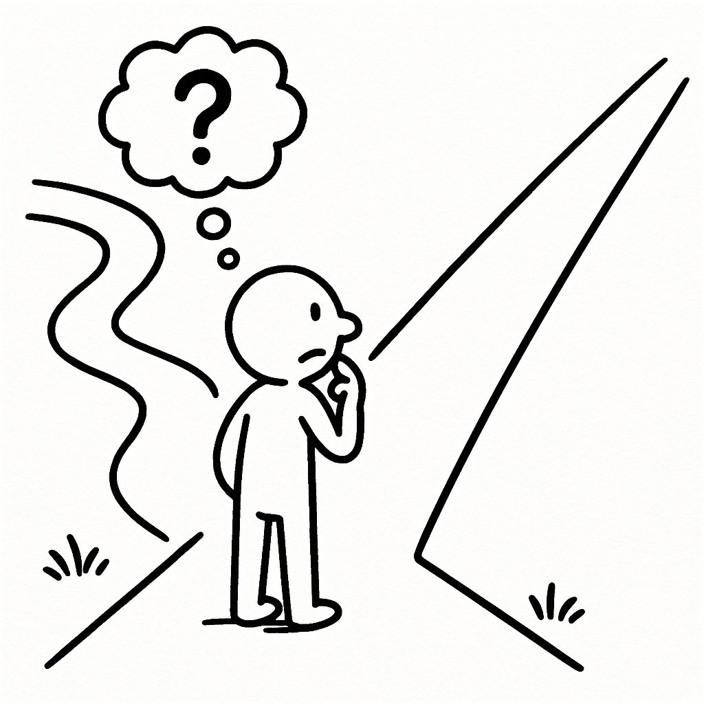

# Giving Up the Straight Line?

Back when I was a student, studying psychological statistics was an ordeal. At that time, I couldn't comprehend why statistics had to be taught this way: I didn't want to know what a sampling distribution was, what the mathematical assumptions and prerequisites were, or why we were forced to calculate those formulas by hand. The partitioning of variance in ANOVA sounded like Greek to both me and many of my classmates. I wouldn't blame this confusion on any single educational system, either. When I went abroad to pursue graduate studies, the exact same agony persisted—among students in the undergraduate statistics labs where I was a teaching assistant, and even among my fellow PhD classmates.

The climax of this shared agony arrived one evening when our graduate study group gathered after class. One of our classmates broke into tears, crying out: *"I don't understand why I have to spend all this damn time studying this. Just tell me where to click!"*

In that moment, I suddenly remembered making the exact same complaint to my classmates during undergrad. As an applied discipline, why do we need to grasp the deep mathematical mechanics of every statistical test? Why can't statisticians standardize the whole workflow, so that we only need to clean our datasets, let the software check whether assumptions are met, whether the p-value is significant, what to report, and have it auto-generate APA tables? That was my fondest wish and deepest puzzle as a young student.

Fast forward to when I became a university lecturer myself and began teaching research methods and statistics. One day, I saw students eagerly circulating a flowchart—or rather, a decision tree—that dictated exactly which statistical test to run based on the data types of the independent and dependent variables. In that instant, all those memories rushed back into my mind. On one hand, I admired each generation's ingenuity and the steady improvement of learning resources, which seemed genuinely striving toward that wish I once harbored. On the other hand, it struck me that every generation of students grapples with the very same need.

If you are hoping to find that decision tree here, I must apologize: I never saved a copy. For me, such a chart does not offer much real help. I spent a long time thinking of arguments to critique that approach, but I realized that such condemnation is neither necessary nor helpful—it sounds far too condescending. In fact, in many subfields of empirical research, one can get quite far with relatively simple models driven purely by point-and-click graphical software—such as a clean two-group experimental vs. control design. Moreover, even if you know very little statistics, you can always outsource that portion of the work to someone else: your co-author, your partner, your advisor, your classmate, or even an online gig worker on Xianyu[^chap1-1] selling their statistical labor. 

How deeply you understand the principles of statistics is entirely up to you. For the reader holding this book right now, the only pitch I can make is this: if you dislike blindly following a recipe without knowing *why* it works; if you want to cultivate at least a convincing illusion that you truly know what you are doing—that is precisely what I hope to offer you in this book.

[^chap1-1]: An Alibaba-owned popular Chinese online marketplace for secondhand goods and gig services.

Rather than handing you a rote operation manual like a decision tree, the learning perspective I want to convey is the exact opposite: we should view statistics from another angle. Most of the common statistical methods in psychology are not isolated, monolithic boxes sitting at the end of a decision branch. A given dataset rarely has only one "correct" analysis method. What I want to show you is their underlying commonality—so that when you encounter a new and unfamiliar statistical technique, you can harness this commonality to grasp (or at least pretend to grasp) the new method much faster.

Admittedly, compared to opening a GUI software and memorizing which menus to click, this journey will take a bit more time. It means taking the scenic detour.

So, if you are still curious, our scenic detour begins with comparing differences between two groups.
