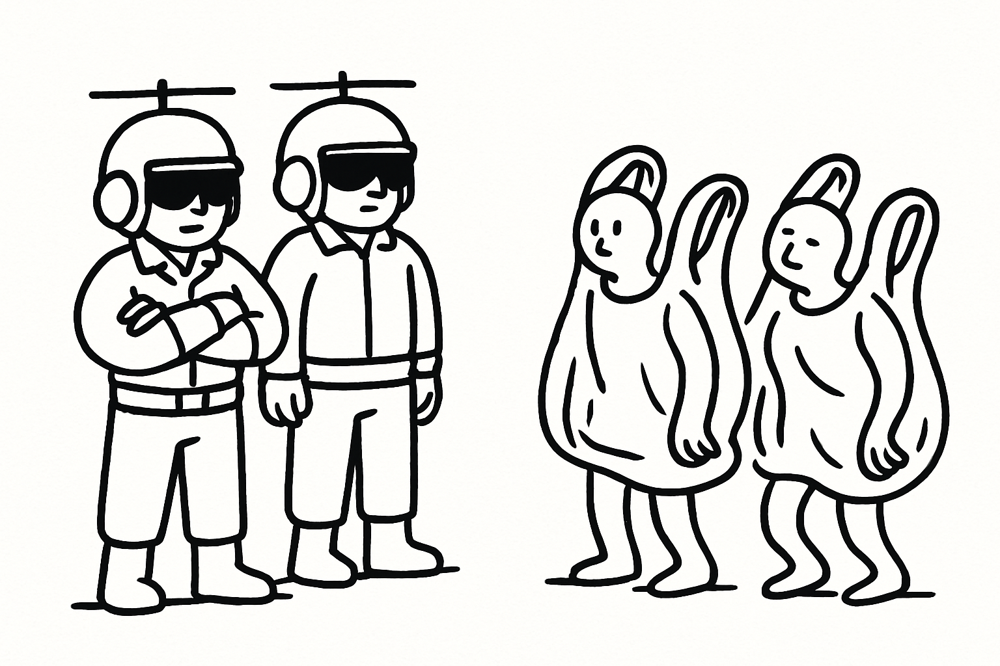
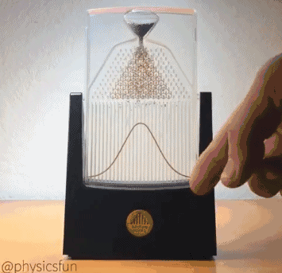

# Fierce Battle? "Helicopter People" vs. "Plastic Bag People"! — Sampling Distributions and the t-test {#chap-2}

You might need to get used to my clickbait title style; after all, I spent an embarrassingly long time concocting these headlines. As social psychology researchers, what we are most adept at is crafting delightfully deceptive trap titles—only for you to start reading and realize you've been thoroughly duped.

The true starting point of psychological statistics lies in the comparison between two groups of data. From here on out, we enter the realm of statistical methods that are genuinely published en masse in empirical journal articles. For a discipline like psychology, this is hardly surprising: we pride ourselves on being an empirical science. Naturally, the most quintessential experimental design to test causal relationships consists of an experimental group and a control group, where we manipulate levels of the independent variable to observe its effect on the dependent variable. Below, let us retrace our steps and revisit the analysis of such data.

First, we need a dataset. Because I am exceptionally lazy and loathe the chore of hunting down an external dataset and setting up download links, we will directly synthesize a "fake" dataset using the code below. Since this is not a dry handbook, I won't dissect every single line in exhaustive detail. Curious readers can copy the code and ask an AI, though I have provided helpful inline comments.

```{r data-preparation}
## Set a random seed so your output matches mine exactly
set.seed(233)
## Generate subject IDs
ID <- c(1:100)
## Categorical variable (predictor)
iden <- as.factor(c(rep("Attack Helicopter", 50), rep("Plastic Bag", 50)))
## Continuous variable (outcome)
magic_score <- c(rnorm(n = 50, mean = 80, sd = 10),
                 rnorm(n = 50, mean = 95, sd = 10))
## Build a dataframe—a table holding our data
df1.1 <- df1 <- data.frame(ID, iden, magic_score)
## Inspect the dataframe
head(df1.1)
tail(df1.1)
```

This is the classic data structure we encounter when first learning psychological statistics. For ease of understanding, gender is typically the most intuitive real-world two-level categorical variable. However, I deliberately wished to steer clear of "male" vs. "female"—those contested real-world categories—lest I inadvertently reinforce gender stereotypes in our readers' minds. Instead, I borrowed two classic internet memes: "Attack Helicopter" and "Brand-Name Plastic Bag." Because I have no desire to advertise for any plastic bag brand, I obscured the brand name, dubbing them "a Certain Brand of Plastic Bag." From this, you can see what an extraordinarily cautious individual I am. Out of this same caution, let me emphasize that using these whimsical identities is merely a playful poke at internet culture; I harbor no disrespect toward the LGBTQ+ movement.

Our backstory unfolds as follows: in an alternate universe not far from our own, there exists a secluded paradise inhabited by two distinct tribes. One tribe identifies as Attack Helicopters, while the other identifies as Plastic Bags. Because these monikers are a mouthful, we shall henceforth refer to them affectionately as the "Helicopter People" (*机人*) and the "Bag People" (*袋人*).



Splendid! We now have our predictor variable, self-identity, named `iden` in the data.[^chap2-1] What about the outcome variable? Spurning mundane scores like test grades or IQ, I decided to label our dependent variable *Magic Talent Score* (`magic_score`). You can think of it this way: the higher someone's magic score, the greater the likelihood of an owl tapping on their window with a Hogwarts acceptance letter. As people who spend their leisure time reading bedtime statistics, we naturally wonder whether one's magic talent is influenced by their gender identity. Intuitively, Helicopter People possess a high affinity for machinery, and should therefore lag behind Bag People in raw magical aptitude. This yields our research hypothesis: there is a difference in magical talent between Helicopter People and Bag People.[^chap2-2]

[^chap2-1]: Strictly speaking, it should be called a predictor variable rather than an independent variable, since one cannot randomly manipulate gender identity. For simplicity, however, this book may occasionally use predictor/outcome and independent/dependent variables interchangeably.

[^chap2-2]: Strictly speaking, our research hypothesis could be directional—namely that Helicopter People have lower magic scores than Bag People (a one-tailed test). For pedagogical convenience, we stick with a two-tailed test. In practice, many reviewers dislike one-tailed tests, viewing two-tailed tests as more conservative.

## Who Has Higher Talent? Answer Me![^chap2-3]

[^chap2-3]: I worry that by the time someone actually reads this book, this meme will have already expired.

First, let's look at the descriptive statistics of our generated data:

```{r}
#| echo: false
#| warning: false
#| message: false
#| fig-responsive: true
#| out-width: "100%"

library(ggplot2)
df1.1$iden_n <- c(rep(0, 50), rep(1, 50))

gg <- ggplot2::ggplot(df1.1, aes(x = iden_n, y = magic_score, fill = iden)) +
  geom_violin(trim = FALSE, alpha = 0.7) +
  geom_boxplot(width = 0.2, color = "black",
               position = position_dodge(0.9),
               outlier.shape = NA,
               show.legend = FALSE) +
  geom_jitter(width = 0.1, alpha = 0.3, color = "black", show.legend = FALSE) +
  stat_summary(
    fun = mean, geom = "point",
    shape = 17, size = 5, color = "red",
    position = position_dodge(0.9),
    show.legend = FALSE
  ) +
  scale_color_manual(values = c("#69b3a2", "#ff9f40")) +
  guides(color = "none") +
  scale_fill_manual(values = c("#69b3a2", "#ff9f40")) +
  labs(title = "Magic Talent Scores across the Two Tribes", x = "Identity", y = "Magic Score") + 
  theme_minimal() +
  theme(aspect.ratio = 3/1,
        plot.title = element_text(hjust = 0.5))

plotly::ggplotly(gg)
```

In the plot above, we portray the magical talent scores of Bag People and Helicopter People. I have layered four distinct visual representations together. The red triangles mark the group means. The caviar-like scatter points represent individual people's scores—each dot corresponds to one person's magical talent score. If you have studied psychological statistics, you already know what a boxplot is; if you haven't, you can guess from the name which one has boxes and whiskers. As for how it represents data, feel free to search online or ask an AI; in short, it utilizes the minimum, maximum, quartiles, and median to mark the distribution. The final element is the trendy violin plot I drew, which intuitively reflects the full probability density contour of the data. As for how to interpret it in depth, I leave that to your own self-guided web exploration.

Now, imagine for a moment: what if the data we generated represented the *entire population* of all Helicopter People and Bag People in that secluded paradise? If I asked you whether a difference in magical talent exists between the two tribes in this realm, how would you respond?

You would likely point at the screen and say: "Yes." If I pressed further: "How do you know there's a difference?" You'd reply: "Look, Helicopter People have lower scores on average than Bag People." If I countered: "What do you mean by lower? Look, some Helicopter individuals scored higher than some Bag individuals!" You'd roll your eyes: "Look at the means! On average, Helicopter People score lower. Are you blind to those two red triangles?"

You have probably noticed by now: I am precisely that eccentric lecturer who loves interrogating students with questions everyone already knows the answer to.

This playful exchange illustrates the most intuitive essence of our statistical journey. When comparing two groups, we naturally lean on metrics like the arithmetic mean to understand what is going on. For instance, if you were ever fortunate enough to serve as a class monitor, and the teacher asked you to "summarize" the midterm exam performance of two classes, how would you answer?

*"Reporting, Teacher! Class 1 performed better than Class 2 in English this time—their average was 5 points higher!"*

That is the statistical process in a nutshell: the mean is the quintessential descriptor of central tendency. By comparing means, we address our research question: Helicopter People and Bag People exhibit differences in magical talent.

Yet an indignant reader might object: *"Wait a minute! You promised to teach statistics, and here you are just telling me to eyeball which mean is bigger? Do you think I've never taken statistics? Where is the real test? Doesn't any sane person know we need an independent-samples t-test here?"*[^chap2-4]

[^chap2-4]: If anyone genuinely does not know what an independent-samples t-test is, please don't take offense. It wasn't me speaking—it was an imaginary reader in my head. If you insist that this imaginary reader is merely an alter ego of mine, I can only counter: if I disown what my split personality says, and my split personality refuses to acknowledge me, can we view this situation as an accidental overlap of parallel universes? Furthermore, given that parallel universes were largely conceived to resolve the Schrödinger's cat paradox arising from wave function collapse, if you were the one who put the cat into the black box, are you legally liable while the cat is in a superposition state? If you don't even wish to bear legal liability, is the answer to this question still an obtuse angle?

I know you're eager, but don't rush. That brings us squarely to the independent-samples t-test.

## Where the Dream Began: Inferential Statistics, Sampling Distributions, and the t-test

### Samples and Inferential Statistics

As our irritable friend noted above, if you present this data to an undergraduate who barely passed introductory statistics and ask which analysis to apply, they would unhesitatingly answer: an independent-samples $t$-test. Indeed, we can run an independent-samples $t$-test on this dataset. But *why* choose an independent-samples $t$-test?

Take a few minutes to organize your thoughts and reflect on what you learned about the $t$-test in past courses, finding an answer that truly satisfies you. If you've never taken statistics, or if your mind is an absolute blank right now, fear not: I have no intention of abandoning you. Read on.

First, we need to clarify: what is the fundamental prerequisite for testing a hypothesis by directly comparing two means? There is one crucial condition:

> *If our generated dataset was the entire population of all Helicopter and Bag People in existence.*

In other words, if our sample *is* the population, descriptive statistics alone are entirely sufficient to test the hypothesis. When can we *not* rely solely on descriptive statistics? Obviously, whenever our data is not the population itself.

Imagine tens of thousands of Helicopter People and Bag People living across this realm. As an impoverished social scientist, how can you compare their magical talent? You certainly don't have the funding to survey tens of thousands of subjects. Aside from fabricating data in your bedroom, your only legitimate choice is to survey a small sample from each group and *infer* the true state of the population from the sample. This approach is almost an instinctive choice.

```{r}
aggregate(magic_score ~ iden, data = df1.1, FUN = mean, na.rm = TRUE)
```

Suppose you surveyed 50 people from each tribe, yielding means of 81.24 and 95.29. If you boldly announce: "Based on these 100 individuals, Bag People are definitively more magical than Helicopter People," a skeptic like me will immediately object: *"Objection! Out of tens of thousands of people, how can you make that claim based on just 50 per group? What if by sheer bad luck you sampled unusually gifted Bag People and unusually inept Helicopter People?"*

Any astute reader understands: any randomly drawn sample inevitably carries sampling error. While rigorous random sampling minimizes bias, it cannot eliminate random fluctuation. What if you drew an outlier sample by chance? Randomness loves surprises. It's like opening blind boxes: even if the merchant plays fair and 99 out of 100 boxes contain items you love, you can never guarantee your unlucky hand won't pull the solitary dud, can you?

### Null Hypothesis Significance Testing (NHST) {#sec-零假设显著性检验}

This is why we need a statistical instrument to tell us: to what extent does the observed difference between our two sample means reflect a true difference in the underlying populations, rather than mere noise introduced by random sampling? This instrument is inferential statistics, invented by ingenious statisticians. Null Hypothesis Significance Testing (NHST) is one such framework, and arguably the most widely practiced in empirical research.[^chap2-5]

[^chap2-5]: In recent years, Bayesian statistics has gained tremendous momentum as an alternative to NHST. Conceptually, Bayesian logic is arguably more intuitive, but its tooling convenience still lags behind NHST. From my non-expert perspective, Bayesian statistics and NHST share no fundamental antagonism; researchers who misuse NHST can misuse Bayesian methods just as easily. Such misuse stems not merely from shaky statistical literacy among empirical researchers, but from systemic publishing incentives (fixation on p-values, journal ranking prestige, etc.). Systemic problems cannot be cured by merely switching statistical paradigms.

First, let us reconfirm our research hypothesis: Helicopter People and Bag People differ in magical talent.

As mentioned earlier, in practice we compare the population means of the two groups. We denote the population mean of Helicopter People as $\mu_{\text{Helicopter}}$ and that of Bag People as $\mu_{\text{Bag}}$. We use $\mu$ rather than $M$ because this mean represents the population, not the sample. Conventionally, Greek letters denote population parameters, while Latin letters denote sample statistics. Note that our research hypothesis is formulated regarding the populations, not the specific samples drawn.

Mathematically, our hypothesis is written as:
$$\mu_{\text{Helicopter}} \ne \mu_{\text{Bag}}$$

Clean and crisp. Applying our middle-school algebra to shift terms to one side, this equation becomes:
$$\mu_{\text{Bag}} - \mu_{\text{Helicopter}} \ne 0$$

In other words, if the difference between their population means does not equal zero, the two groups differ in talent. Perfectly sound.

An impatient reader might ask: what does this have to do with inferential statistics? Remember, we lack population census data; we must use our sample difference $M_{\text{Bag}} - M_{\text{Helicopter}}$ to infer whether the population difference $\mu_{\text{Bag}} - \mu_{\text{Helicopter}}$ is non-zero.

However, in statistics, directly proving that a difference does *not* equal zero is extraordinarily difficult—just as the old adage goes, proving you did something is easy, but proving you never did it is nearly impossible. So statisticians in the NHST framework borrowed a classic device from Japanese courtroom mystery games: they inverted their perspective. If proving $\mu_1 - \mu_2 \ne 0$ is hard, what about its negation: $\mu_1 - \mu_2 = 0$? If we can demonstrate that the claim of *zero difference* is wildly improbable ("wrong"), haven't we proven that a non-zero difference is "right"?

Thus, our focus shifts to this statement: Helicopter People and Bag People have *no difference* in magical talent:
$$\mu_{\text{Bag}} - \mu_{\text{Helicopter}} = 0$$

This is the **Null Hypothesis ($H_0$)** (hence NHST). How do statisticians test it? They use the concept of a **sampling distribution**.

### Sampling Distributions

As we noted above, random sampling introduces all kinds of interference, so we cannot know whether a sample we happen to draw accurately reflects its population. One possible solution is to repeat the sampling process many times. A single sample may be unusually high or low, but surely ten thousand samples cannot all miss in exactly the same direction. Most of those sample means should be reasonably close to the population mean. If we then average those ten thousand sample means, that average should be close to the population mean as well.

This intuition captures part of the central idea behind the **Central Limit Theorem**. In a deliberately informal formulation,[^chap2-6] if we repeatedly draw samples of size $n$ from a population, the sampling distribution of the mean of an independent and identically distributed random variable tends toward a normal distribution. That normal distribution has the population mean, $\mu$, as its mean and the population variance divided by the sample size, $\sigma^2/n$, as its variance. Here, $\sigma$ is the population standard deviation. This is the sampling distribution.

[^chap2-6]: In other words, this is my own subjective interpretation, and may therefore contain some bias.

{fig-alt="An animation sourced from the web; see the watermark for its original source."}

The Galton board above provides a physical example of the Central Limit Theorem and sampling distributions. As each ball falls, it encounters a sequence of forks. At every fork, it has a 50% chance of moving left or right.[^chap2-7] Each fork is therefore equivalent to one random draw. We can think of it as the most familiar random experiment in probability: tossing a coin and recording heads or tails.

The final Galton-board pattern can be understood as a frequency distribution. The number of rows traversed by each ball corresponds to the sample size, the total number of balls corresponds to the number of repeated samples, and the horizontal axis records the number of heads—that is, the number of times the ball moved in one specified direction. Coin tossing is an independent and identically distributed binomial random variable. The Galton board shows how the distribution of such a random variable approaches the normal form after repeated sampling.

[^chap2-7]: Here we ignore collisions between balls. They do not affect the general result. Even if you release one ball at a time and release one thousand balls in total, the final pattern is still the same.

If you know the English name *Normal Distribution*, you can probably see why this distribution appears so often in real-world data that failing to follow it is jokingly treated as being "abnormal." Because it is so normal, statisticians know its properties extremely well. In a normal distribution, the region within one standard deviation of the mean contains approximately 68% of the observations; the region within two standard deviations contains approximately 95%.

Once we know the mean and standard deviation of normally distributed data, we can draw its distribution. For convenience, statisticians defined a special normal distribution with mean 0 and standard deviation 1: the **standard normal distribution**. Any normally distributed score can be converted into a standard normal score, or $Z$-score, by subtracting its mean and dividing by its standard deviation:

$$Z = \frac{X - \bar{X}}{s}$$

Here, $X$ is the raw score, $\bar{X}$ is the raw-score mean, and $s$ is the raw-score standard deviation.

```{r}
#| echo: false
#| warning: false
#| message: false
library(ggplot2)

mu <- 0
sigma <- 1
x <- seq(mu - 4*sigma, mu + 4*sigma, length.out = 200)
data <- data.frame(x = x, y = dnorm(x, mu, sigma))

data$area_2sigma <- ifelse(abs(data$x) <= 2, data$y, NA)
data$area_1sigma <- ifelse(abs(data$x) <= 1, data$y, NA)

ggplot2::ggplot(data, aes(x = x)) +
  geom_line(aes(y = y), color = "blue", linewidth = 1) +
  geom_area(aes(y = area_2sigma), fill = "#E0E0E0", alpha = 0.4) +
  geom_area(aes(y = area_1sigma), fill = "#98D9A9", alpha = 0.8) +
  annotate("text", x = 0, y = dnorm(0)*0.5, 
           label = "±1σ: 68.27%", color = "darkgreen", size = 4) +
  annotate("text", x = 0, y = dnorm(0)*0.3, 
           label = "±2σ: 95.45%", color = "#333333", size = 4) +
  labs(title = "Standard Normal Distribution (Marking Standard Deviation Intervals)", 
       x = "z-score", y = "Probability Density") +
  theme_minimal()
```

What does it mean that a sampling distribution follows a normal distribution? If you toss a fair coin (50% heads) 100 times per workout, across 1,000 workouts, the number of heads will follow a normal distribution. In probability terms, outcomes closer to the center are overwhelmingly more likely to occur. A sampling distribution reflects both observed frequencies and the probabilistic likelihood of observing a particular sample result.

### The t-Distribution {#sec-tdis}

What is the point of all this theoretical setup? Remember our goal: we want to test the null hypothesis $\mu_{\text{Bag}} - \mu_{\text{Helicopter}} = 0$. If the left-hand side is treated as a random variable (like $X$ in the $Z$-score formula), can we construct its theoretical sampling distribution under the condition that the null hypothesis is true?

Recall the properties of a sampling distribution: for a random variable, it is a normal distribution centered at the population mean $\mu$, with variance $\sigma^2/n$. What is the population mean difference under the null? The right side of the null hypothesis tells us directly: it equals 0!

What about the variance? The null hypothesis says nothing about variance. Statisticians found a clever workaround: while we don't know the population variance, our sample contains information about it. We can estimate the variance of the sampling distribution using the sample variance and sample size. If we were comparing a single sample mean against a known constant, matters would be straightforward.[^chap2-8] But here we have two samples, calculating the difference between two sample means: $\mu_{\text{Bag}} - \mu_{\text{Helicopter}}$. To treat this difference as a clean random variable without letting mathematics become intractable, a small sacrifice is required.

That sacrifice is the assumption that the population variances of Helicopter People and Bag People are equal. If their population variances are equal, the sampling distribution of $\mu_{\text{Bag}} - \mu_{\text{Helicopter}}$ follows not a standard normal distribution, but Student's **t-distribution**.[^chap2-9] The requirement that the two groups share equal variance is the famous **assumption of homogeneity of variance (homoscedasticity)**.

[^chap2-8]: That would be a one-sample t-test, but I have no desire to rewrite an entire introductory textbook from scratch, and one-sample tests are rare in empirical psychology anyway.

[^chap2-9]: Strictly speaking, the t-distribution is a family of distributions whose curves vary with degrees of freedom ($df = n_1 + n_2 - 2$). As sample size increases, the t-distribution converges toward the standard normal. With smaller samples, it has fatter tails. Be polite: don't ask a normal distribution in front of a t-distribution why its head is so pointy.

Now we possess the theoretical sampling distribution of the difference between two means under the null hypothesis. Just as data points convert to $Z$-scores, our sample difference converts into a **t-score** to determine where our observed difference sits within the null distribution:

$$
t = \frac{\bar{X}_{1} - \bar{X}_{2}}{\sqrt{s^2_p\left(\frac{1}{n_1}+\frac{1}{n_2}\right)}}
$$ {#eq-tee}

where:

$$
s^2_p = \frac{(n_1-1)S_1^2 + (n_2-1)S_2^2}{n_1 + n_2 - 2}
$$

Astute readers will notice that the $t$-statistic resembles a $Z$-score: a mean difference divided by an estimated standard error. With two samples, we pool their variances into an omnibus estimate, $s^2_p$. The algebraic derivation of $s^2_p$ hinges directly on the premise that the two population variances are equal—hence the homogeneity of variance assumption.

```{r}
#| echo: false
#| warning: false
#| message: false

set.seed(233)
n_sim <- 10000
n1 <- 50; n2 <- 50
mu1 <- 90; mu2 <- 90
sd1 <- 10; sd2 <- 10

t_values <- replicate(n_sim, {
    group1 <- rnorm(n1, mu1, sd1)
    group2 <- rnorm(n2, mu2, sd2)
    t.test(group1, group2, var.equal = TRUE)$statistic
})

df_t <- n1 + n2 - 2
critical_two_tail <- qt(0.975, df_t)
critical_one_tail <- qt(0.95, df_t)

plot_data <- data.frame(t = t_values)

ggplot(plot_data, aes(x = t)) +
  geom_histogram(aes(y = ..density..), bins = 50, fill = "skyblue", alpha = 0.5) +
  stat_function(fun = dt, args = list(df = df_t), 
                color = "red", linewidth = 1, linetype = "dashed") +
  labs(title = "Null Sampling Distribution of t (When Groups Do Not Differ)",
       x = "t value", y = "Density") +
  theme_minimal() +
  theme(legend.position = "bottom",
        panel.grid.major = element_line(color = "grey90"))
```

The histogram above is the empirical distribution of $t$-statistics when the null hypothesis holds true. If Helicopter and Bag People truly possess identical talent, and we repeatedly draw 50 subjects from each group 10,000 times and compute their $t$-values, we obtain this bell curve. Higher density along the dashed red curve indicates higher probability. Values clustered near $t = 0$ (corresponding to zero true difference) occur with the greatest frequency.

Now, let us calculate the empirical $t$-value of our actual sample using @eq-tee:

```{r}
## Calculate sample means
X1 <- mean(df1.1[df1.1$iden == "Plastic Bag", "magic_score"])
X2 <- mean(df1.1[df1.1$iden == "Attack Helicopter", "magic_score"])

## Sample sizes (50 per group)
n1 <- n2 <- 50

## Sample variances
s12 <- var(df1.1[df1.1$iden == "Plastic Bag", "magic_score"])
s22 <- var(df1.1[df1.1$iden == "Attack Helicopter", "magic_score"])

## Calculate pooled variance sp^2
sp2 <- ((n1 - 1)*s12 + (n2 - 1)*s22) / (n1 + n2 - 2)

## Substitute into formula for t
t <- (X1 - X2) / sqrt(sp2 * (1/n1 + 1/n2))
t
```

Where does our empirical $t$-value sit within the null distribution? Let's plot it as a solid purple vertical line:

```{r}
#| echo: false
#| warning: false
#| message: false

actual_t <- 7.636829

ggplot2::ggplot(plot_data, aes(x = t)) +
  geom_histogram(aes(y = ..density..), bins = 50, fill = "skyblue", alpha = 0.5) +
  stat_function(fun = dt, args = list(df = df_t), 
                color = "red", linewidth = 1, linetype = "dashed") +
  geom_vline(xintercept = t, color = "purple", linetype = "solid", linewidth = 1.2) +
  geom_segment(x = t - 0.3, xend = actual_t - 1.5, y = 0.35, yend = 0.35,
               arrow = arrow(length = unit(0.2, "cm")), color = "purple") +
  annotate("text", x = t - 1.8, y = 0.36, 
           label = paste("Observed t =", round(t, 2)), 
           color = "purple", size = 4, hjust = 1) +
  coord_cartesian(xlim = c(min(t_values), max(10, t + 1))) +
  labs(title = "Observed t vs. Theoretical Null Sampling Distribution",
       x = "t value", y = "Density") +
  theme_minimal() +
  theme(legend.position = "bottom",
        panel.grid.major = element_line(color = "grey90"))
```

Look at where that purple line lands! It is located unimaginably far from the center, where the theoretical probability density is virtually zero. In plain language: if Helicopter and Bag People truly had identical magical talent, the probability of obtaining a sample difference this large by sheer chance is practically zero ($p < 0.0000000001$).

When an event has an infinitesimally small probability of occurring by chance, common sense dictates that it was not a fluke. Either we accept that a one-in-a-billion miracle occurred, or we recognize that the premise behind our probability model was flawed. What was the premise? Our null hypothesis!

And there you have it: that is how we reject the null hypothesis via a sampling distribution. We formulate a null hypothesis, deduce its theoretical sampling distribution, and map our observed sample onto it. If the probability of observing our sample under the null is sufficiently low, we reject the null hypothesis.

What does rejecting the null hypothesis mean? It means we finally accept our research hypothesis: Helicopter People and Bag People genuinely differ in magical talent! In academic parlance, the difference is statistically significant.

Skeptical readers will naturally ask: what defines "sufficiently low"? This is one of the classic critiques of NHST. In social science practice, we convention-bound researchers conventionally adopt a 5% threshold ($\alpha = 0.05$). If a sample result has less than a 5% chance of occurring under the null, we deem it sufficiently improbable to justify rejecting $H_0$. This threshold is the significance level $\alpha$, reflecting our tolerance for a Type I error (falsely rejecting a true null hypothesis). For discussion on Type II error and statistical power analysis, feel free to consult the appendix.

```{r}
#| echo: false
#| warning: false
#| message: false

set.seed(233)
n_sim <- 10000
n1 <- 50; n2 <- 50
mu1 <- 90; mu2 <- 90
sd1 <- 10; sd2 <- 10

t_values <- replicate(n_sim, {
    group1 <- rnorm(n1, mu1, sd1)
    group2 <- rnorm(n2, mu2, sd2)
    t.test(group1, group2, var.equal = TRUE)$statistic
})

df_t <- n1 + n2 - 2
plot_data <- data.frame(t = t_values)
critical_t <- qt(0.975, df = df_t)

ggplot2::ggplot(plot_data, aes(x = t)) +
  geom_histogram(aes(y = ..density..), bins = 50, fill = "skyblue", alpha = 0.7) +
  stat_function(fun = dt, args = list(df = df_t), 
                color = "red", linewidth = 1.2, linetype = "dashed") +
  labs(title = "Critical Regions of the Independent-Samples t-test",
       x = "t value", y = "Density") +
  geom_vline(xintercept = c(-critical_t, critical_t), 
             color = "darkgreen", linetype = "dotted") +
  annotate("text", x = critical_t + 0.5, y = 0.3, 
           label = paste("α = 0.05\nCritical t = ±", round(critical_t, 2)), 
           color = "darkgreen") +
  theme_minimal()
```

As illustrated above, with sample sizes of 50 per group ($df = 98$) at $\alpha = 0.05$, any observed $t$-value whose absolute value exceeds 1.98 falls in the rejection region, allowing us to reject the null hypothesis.

::: {.callout-caution icon="false"}
## Caution
Note that the sampling distribution is an abstract, hypothetical construct derived under the assumption that the null hypothesis is true. It is not the empirical distribution of individual raw data points collected in a study. A frequent point of confusion is conflating the sampling distribution of a statistic with the raw data distribution. In our actual sample, the raw data distribution looks like this:

```{r}
#| echo: false
#| warning: false
#| message: false

ggplot2::ggplot(df1.1, aes(x = magic_score, color = iden, fill = iden)) +
  geom_density(alpha = 0.3) +
  scale_color_manual(values = c("#E69F00", "#56B4E9")) +
  scale_fill_manual(values = c("#E69F00", "#56B4E9")) +
  labs(title = "Overlaid Raw Score Density Plot", x = "Magic Talent Score", y = "Density") +
  theme_classic()
```

Notice how this raw distribution was already visualized earlier in our combined violin-boxplot diagram.
:::

::: {.callout-tip icon="false"}
## Food for Thought: What If We Don't Use the Mean?

In descriptive statistics, the mean is not the only metric of central tendency; we also have the median and the mode. Following the same logic, could you invent a "t-test" based on medians? What mathematical obstacles would you encounter when constructing its sampling distribution compared to a mean-based test?
:::

### The t-test in Practice {#sec-t检验实战}

Before writing this book, I assumed you already remembered the sampling distribution theory described above. Yet I know that even students who aced psychological statistics often forget the underlying NHST mechanics over time. If my description wasn't crystal clear, you can always revisit standard textbooks.

Below, I present how a trained psychology researcher conducts an independent-samples $t$-test in practice: swift, practiced, second nature.

First, check the assumption of homogeneity of variance:

```{r}
## Test for equality of variances
var.test(df1.1[df1.1$iden == "Attack Helicopter", "magic_score"],
         df1.1[df1.1$iden == "Plastic Bag", "magic_score"])
```

The $F$-test for equality of variances yields $F = 0.75, df_1 = 49, df_2 = 49, p = 0.3168$. Because the test is non-significant, we fail to reject the null hypothesis of equal variances, and conventionally proceed assuming homoscedasticity.[^chap2-10] Next, we run the standard independent-samples $t$-test:

[^chap2-10]: This practice has its controversies. Recall our NHST logic: failing to reject a null hypothesis does not prove the null hypothesis is true. You cannot verify that variances are identical merely because the test is non-significant. Some modern methodologists recommend always using robust estimators (such as Welch's t-test) by default.

```{r}
## Independent-samples t-test assuming equal variances
t.test(magic_score ~ iden, df1.1, var.equal = TRUE)
```

The output yields $t = 7.6368, df = 98, p = 0.00000000001498$. As a conditioned psychology $p$-value scanning automaton, your eyes inevitably gravitate toward `1.498e-11`, and your brain instantly produces the golden verdict: *"Significant!"* Because this was our handcrafted synthetic dataset, this triumphant result is hardly a surprise.

::: {#tip-assumption .callout-tip icon="false"}
## Food for Thought: Another Assumption to Satisfy

Since this book is a bedtime read rather than an austere reference tome, we won't obsessively recite every textbook assumption for every test. In empirical psychology publications, thorough checks of statistical assumptions are shockingly rare anyway (chuckles). Often, tests are reasonably robust against minor violations—for instance, ANOVA is remarkably robust to heteroscedasticity when group sample sizes are balanced. 

Furthermore, real-world data often departs from strict normality, violating another textbook assumption: that the dependent variable follows a normal distribution within each group.

Astute readers will wonder: the Central Limit Theorem placed no restrictions on the shape of the raw variable itself—for example, coin tosses follow a discrete binomial distribution, yet their sampling distribution of means converges beautifully to normal. Why, then, does the classical $t$-test formally assume that raw scores within each group follow a normal distribution?

Unlike the previous question, this mystery will be illuminated in subsequent chapters. In the meantime, ponder it as you drift off to sleep.
:::

```{r}
#| echo: false
# Save environment objects
save.image("data/chapter2_env.RData")
```
