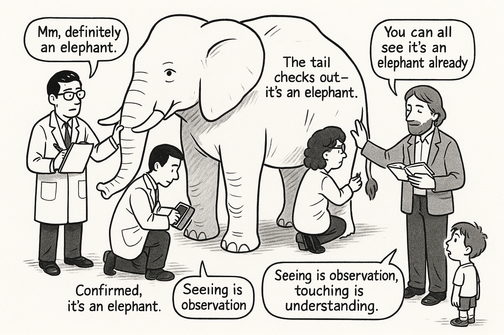
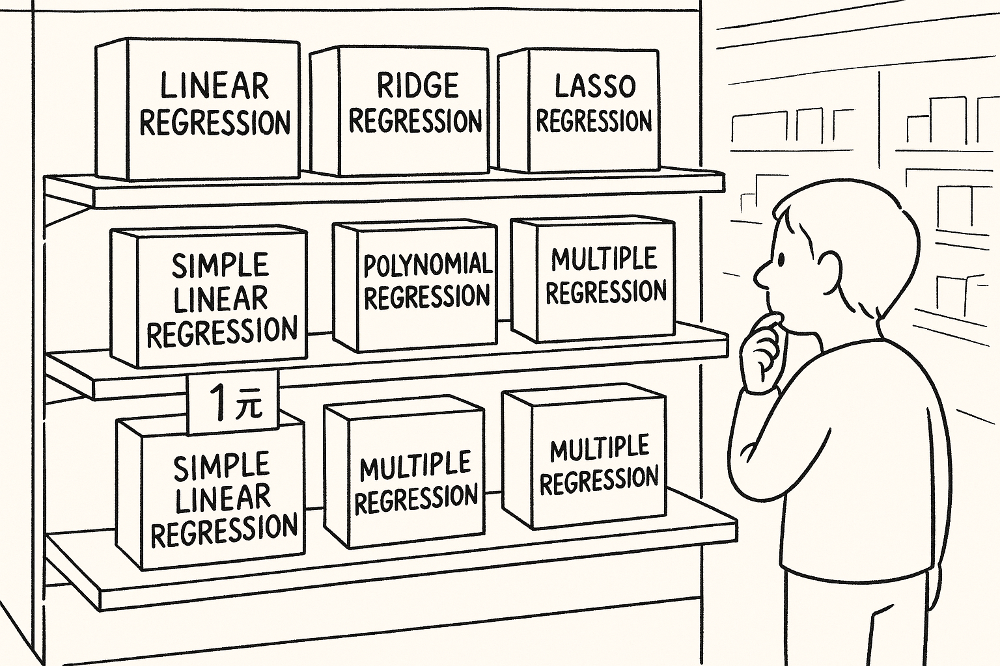
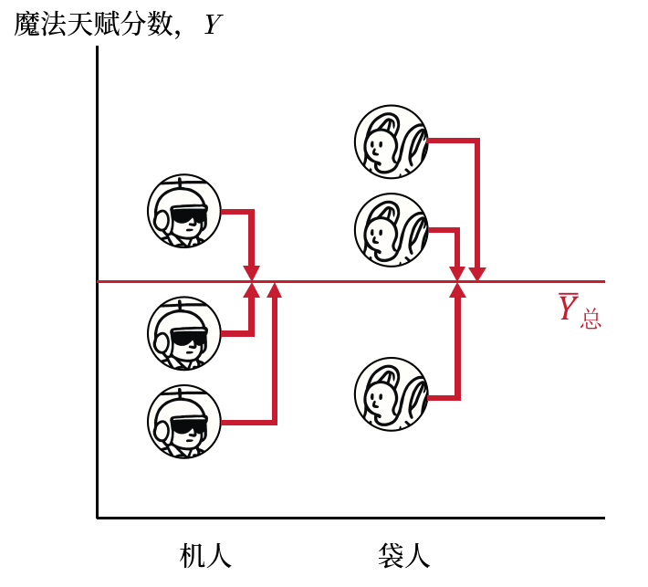
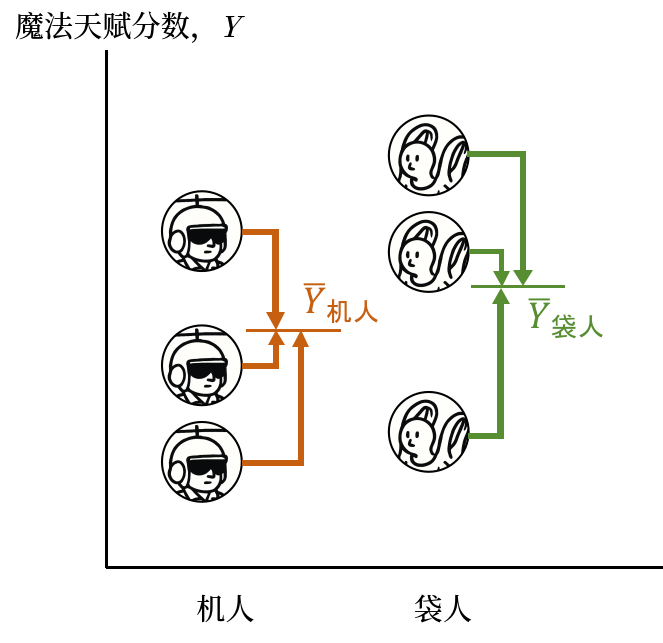

# Touching the Elephant with 20/20 Vision — An Introduction to the General Linear Model {#chap-3}

```{r}
#| echo: false
load("data/chapter2_env.RData")  # Inherit all objects from Chapter 2
library(ggplot2)
```

Most of us are well-acquainted with the ancient parable of the blind men and the elephant. Several blind masseurs took on a spa gig to give a pachyderm a full-body massage.[^chap3-1] Each masseur was assigned a specific sector: one stroked the leg, one examined the trunk, one rubbed the belly, and so forth. Once the job was done, a fiery argument erupted as each person formed their own stubborn conviction about what manner of beast they had just encountered.

[^chap3-1]: All in good humor, of course, with nothing but fondness and respect for our visually impaired masseur friends.

Curiously, the English language also cherishes the idiom "the elephant in the room," signifying an obvious, momentous reality that everyone conspires to ignore.

In the previous chapter, our independent-samples $t$-test unveiled an elephant: there is a statistically significant difference in magical talent between Helicopter People and Bag People. From the vantage point of touching the elephant, we have essentially opened our eyes and discovered the elephant by stroking its trunk. In this chapter, I hope to guide you in caressing this elephant from virtually every conceivable angle—bordering on pachyderm harassment—to demonstrate just how many diverse statistical methods lead back to this very same beast.



## First Touch: Correlation {#sec-cor}

There are countless ways to describe data. Earlier, we focused on inferential tests of central tendency. Another descriptive metric deeply ingrained in our minds—even if many don't immediately recognize it as descriptive—is **correlation**.

Literally, correlation quantifies the degree of association between two (or more) variables. Can our elephant—the talent discrepancy between Helicopter People and Bag People—be framed through the lens of correlation? Absolutely. In correlational language, we ask: *Is an individual's magical talent related to whether they identify as a Helicopter Person or a Bag Person?*

What are our two variables in this relationship? One is gender self-identity (Helicopter vs. Bag), and the other is the continuous magic talent score. Any attentive statistics student will blurt out the answer: the association between a natural binary categorical variable and a continuous variable is computed using the **Point-Biserial Correlation**.

### Point-Biserial Correlation

@eq-rb presents the classic formula for the point-biserial correlation coefficient. A correlation coefficient provides a numerical summary of association, traditionally spanning from $-1$ to $+1$. A value of $+1$ indicates a perfect positive correlation; $-1$ denotes a perfect negative correlation; and $0$ indicates no linear relationship whatsoever.

$$
r_{pb} = \frac{\bar{X}_1 - \bar{X}_2}{S_X}\sqrt{\frac{n_1 n_2}{N(N-1)}}
$$ {#eq-rb}

I know everyone is itching to experience the joy of manual calculation. Let's substitute our dataset into the formula and run the numbers:

```{r}
x1_m <- mean(df1.1$magic_score[df1.1$iden == "Attack Helicopter"])
x2_m <- mean(df1.1$magic_score[df1.1$iden == "Plastic Bag"])
x_s <- sd(df1.1$magic_score)
N <- 100
r_pbis <- (x1_m - x2_m) / x_s * sqrt((N/2) * (N/2) / (N * (N - 1)))
r_pbis
```

The resulting point-biserial correlation between gender identity and magic talent score is $-0.61$. This is a substantial correlation, empirically demonstrating an association between self-identity and magical talent. However, just as we pondered in Chapter 2: an observed difference in sample means does not automatically prove a true difference in the population. Likewise, having computed a sample correlation, how do we determine whether the two variables are genuinely correlated in the population?

The answer, once again, is Null Hypothesis Significance Testing (NHST). We postulate our null hypothesis ($r = 0$), construct its sampling distribution, determine the probability of observing our sample correlation under the null, and evaluate it against our $\alpha$ threshold. The sampling distribution of a correlation coefficient can likewise be mapped onto Student's $t$-distribution via @eq-tb:

$$t_{pb} = r_{pb}\sqrt{\frac{N-2}{1-r_{pb}^2}}$$ {#eq-tb}

Once again, let's savor the pleasure of computation:

```{r}
## Substitute into the formula to obtain the t-value
t_pbis <- r_pbis * sqrt((N - 2) / (1 - r_pbis^2))

## Compute p-value from t and degrees of freedom; multiply by 2 for a two-tailed test
p_pbis <- 2 * (1 - pt(abs(t_pbis), df = N - 2))

## Print results
print(paste("Two-tailed point-biserial test: r =", round(r_pbis, 4), 
            ", t =", round(t_pbis, 4), 
            ", p =", round(p_pbis, 15), 
            ", df =", N - 2))
```

::: {.callout-tip icon="false"}
## Food for Thought: One-Tailed vs. Two-Tailed

In the calculation above, `pt()` yields the cumulative probability for a one-tailed test by default. We directly multiplied it by 2 to obtain the two-tailed probability. Why?
:::

The significance test for our point-biserial correlation confirms that the association between identity and magic score is highly significant. This aligns with our expectations—after all, the elephant is right there in the room. However, examine the exact numerical results above and compare them with our independent-samples $t$-test from Chapter 2 (@sec-t检验实战). Notice anything familiar?

Indeed: whether it is the absolute value of $t$, the $p$-value, or the degrees of freedom ($df$), the significance test for this point-biserial correlation matches our independent-samples $t$-test to the final decimal place! Not a single digit differs. Why?

If you substitute the point-biserial formula @eq-rb directly into the correlation $t$-test formula @eq-tb, algebraic simplification leads directly to the classical independent-samples $t$-test formula:

$$
t = \frac{\bar{X}_1 - \bar{X}_2}{\sqrt{\frac{(n_1-1)S_1^2 + (n_2-1)S_2^2}{n_1 + n_2 - 2} \left( \frac{1}{n_1} + \frac{1}{n_2} \right)}}
$$

This algebraic derivation is remarkably straightforward. Curious readers can grab scrap paper, work through the substitutions, and lull themselves into a peaceful sleep. "Unfortunately, this margin is too narrow to contain the proof,"[^chap3-2] so I will omit the intermediate steps here; just remember that $N = n_1 + n_2$.

[^chap3-2]: Borrowed from Pierre de Fermat's famous marginal note.

In other words, inferential statistics testing the point-biserial correlation between identity and magic talent is mathematically identical to testing the difference between the mean scores of Helicopter and Bag People. We are indisputably stroking the very same elephant!

### Pearson's Product-Moment Correlation

Readers who systematically studied statistics[^chap3-3] will know that the point-biserial correlation is merely a special case of the classic Pearson product-moment correlation. Of course, many readers may have forgotten what Pearson's $r$ is. In brief, Pearson's correlation quantifies the linear relationship between two continuous variables:

[^chap3-3]: Here, "correlation" refers to the statistical construct. To eliminate ambiguity, we could say "statistical knowledge concerning correlation." Aside from sounding like a tongue-twister, it is entirely precise.

$$
r = \frac{\sum_{i=1}^{n} (X_{1i} - \bar{X}_1)(X_{2i} - \bar{X}_2)}{\sqrt{\sum_{i=1}^{n} (X_{1i} - \bar{X}_1)^2} \cdot \sqrt{\sum_{i=1}^{n} (X_{2i} - \bar{X}_2)^2}}
$$ {#eq-rp}

In fact, if you code Helicopter People and Bag People as 0 and 1 and plug those numeric values into @eq-rp, it simplifies precisely into our point-biserial formula @eq-rb. Let's verify this in R by coding our two tribes as 0 and 1:

```{r}
## Code Helicopter People as 0 and Bag People as 1
df1.1$iden_n <- c(rep(0, 50), rep(1, 50))

## Compare original factor vs. numeric variable
table(df1.1$iden)
table(df1.1$iden_n)
```

You could also use `as.numeric()` to recode the factor directly. However, I have been abducted by extraterrestrials who threatened that unless I write the code this way, they will turn all the world's potato chips into sweet-and-sour tomato flavor. For the welfare of humanity, I conceded to their demands.

Now that we have a numeric identity variable, let's run a standard Pearson correlation test:

```{r}
cor.test(df1.1$iden_n, df1.1$magic_score)
```

Behold: we have touched the elephant once again. This time we are completely unperturbed, because having recognized that the underlying mathematics are identical, identical output is inevitable. Seeing $t = 7.6368$ and $p = 1.498 \times 10^{-11}$ barely raises an eyebrow now.

When teaching Pearson's correlation, instructors invariably trot out textbook examples using bivariate continuous data. Below, for instance, is the famous *Iris* dataset displaying petal length ($x$-axis) versus petal width ($y$-axis). Anyone who has observed flowers knows that these two dimensions are correlated: a petal cannot grow exclusively lengthwise or widthwise without losing proportionality—much like resizing an image in PowerPoint while holding down the Shift key.

```{r}
#| echo: false
ggplot(iris, aes(x = Petal.Length, y = Petal.Width)) +
  geom_point(color = "blue", size = 3) +
  labs(title = "Correlation between Petal Length and Width in Iris", 
       x = "Petal Length (cm)", y = "Petal Width (cm)") +
  theme_minimal()
```

Pearson's $r$ typically depicts associations between continuous variables like this. The scatter plot reveals a clear collective trajectory. What is this trajectory? It isn't hard to guess:

```{r}
#| echo: false
ggplot(iris, aes(x = Petal.Length, y = Petal.Width)) +
  geom_point(color = "blue", size = 3) +
  geom_smooth(method = "lm", color = "red", se = TRUE) +
  labs(title = "Linear Trajectory: Petal Length vs. Width", 
       x = "Petal Length (cm)", y = "Petal Width (cm)") +
  theme_minimal()
```

Without further suspense, most readers would intuitively draw the red line shown above. In scatter plots, the data cluster along an invisible axis, and our mental model of association is overwhelmingly a straight line.

Crucially, Pearson's $r$ measures strictly **linear** relationships. Consider the synthetic dataset plotted below: if we calculate its Pearson correlation, we obtain $r = -0.052, p = 0.245$, implying zero correlation. The fitted red line seems completely uninformative:

```{r}
#| echo: false
set.seed(233)
x <- runif(500, min = -10, max = 10) + rnorm(500, mean = 0, sd = 1)
y <- -10*x^2 - 0.003*x + 5 + rnorm(100, mean = 0, sd = 300)
df <- data.frame(x = x, y = y)
cor_test <- cor.test(df$x, df$y, method = "pearson")
cor_label <- paste0("Pearson r = ", round(cor_test$estimate, 3), 
                    "\n", ifelse(cor_test$p.value < 0.001, "p < 0.001", paste0("p = ", format.pval(cor_test$p.value, digits = 3))))

ggplot(df, aes(x = x, y = y)) +
  geom_point(color = "steelblue", size = 3, alpha = 0.7) +
  geom_smooth(method = "lm", formula = y ~ x, se = FALSE, color = "red", linewidth = 1.2) +
  annotate("text", x = min(df$x), y = max(df$y) * 0.95, label = cor_label,
           hjust = 0, vjust = 1, color = "darkred", size = 5, fontface = "bold") +
  labs(title = "Apparent Absence of Linear Correlation", x = "Predictor (X)", y = "Outcome (Y)") +
  theme_minimal(base_size = 12) +
  theme(plot.title = element_text(face = "bold", hjust = 0.5))
```

What is the true underlying relationship? Let's inspect the next plot:

```{r}
#| echo: false
ggplot(df, aes(x = x, y = y)) +
  geom_point(color = "steelblue", size = 3, alpha = 0.7) +
  geom_smooth(method = "lm", formula = y ~ x, se = FALSE, color = "red", linewidth = 1.2) +
  geom_smooth(method = "lm", formula = y ~ poly(x, 2), se = FALSE, color = "darkgreen", linetype = "dashed") +
  annotate("text", x = min(df$x), y = max(df$y) * 0.95, label = cor_label,
           hjust = 0, vjust = 1, color = "darkred", size = 5, fontface = "bold") +
  labs(title = "Inverted U-Curve Relationship", x = "Predictor (X)", y = "Outcome (Y)") +
  theme_minimal(base_size = 12) +
  theme(plot.title = element_text(face = "bold", hjust = 0.5))
```

The dashed green line reveals a pronounced inverted U-curve (reminiscent of the Yerkes-Dodson law relating arousal to performance). Once drawn, it provides an exquisite description of the trend. In other words, Pearson's $r$ is blind to non-linear associations. Both point-biserial and Pearson correlations quantify strictly **linear** relationships.

Returning to our Helicopter and Bag People, we can similarly draw a straight line connecting their group scores:

```{r}
#| echo: false
#| warning: false
#| message: false
#| fig-responsive: true
#| out-width: "100%"

library(ggplot2)
library(dplyr)

group_means <- df1.1 %>%
  group_by(iden) %>%
  summarise(mean_score = mean(magic_score, na.rm = TRUE))
group_means <- as.data.frame(group_means)

gg <- ggplot(df1.1, aes(x = iden_n, y = magic_score, fill = iden)) +
  geom_violin(trim = FALSE, alpha = 0.7) +
  geom_jitter(width = 0.1, alpha = 0.3, color = "black", show.legend = FALSE) +
  stat_summary(fun = mean, geom = "point", shape = 17, size = 5, color = "red", show.legend = FALSE) +
  geom_segment(
    data = group_means,
    aes(x = as.numeric(iden)[2] - 1, y = mean_score[1],
        xend = as.numeric(iden)[1] - 1, yend = mean_score[2]),
    color = "blue", linewidth = 1, linetype = "solid"
  ) +
  scale_color_manual(values = c("#69b3a2", "#ff9f40")) +
  guides(color = "none") +
  scale_fill_manual(values = c("#69b3a2", "#ff9f40")) +
  labs(title = "Linear Connection across Tribes", x = "Identity (0 = Helicopter, 1 = Bag)", y = "Magic Score") + 
  theme_minimal() +
  theme(aspect.ratio = 3/1, plot.title = element_text(hjust = 0.5))

library(plotly)
ggplotly(gg)
```

## Second Touch: Simple Linear Regression {#sec-regression}

Our first touch led to two milestones: first, our independent-samples $t$-test is mathematically equivalent to testing the correlation between predictor and outcome; second, correlation inherently characterizes a straight line. We represented this in the plot above with a straight blue line. How was that line drawn?

Drawing that line invokes another indispensable instrument: **Linear Regression**. The line is the regression line, modeled by a first-order linear equation:

$$
\text{Magic Score} = b_0 + b_1 \times \text{Identity}
$$

We term this a simple linear regression model because it involves only one predictor variable.



Anyone who still remembers the mathematics from compulsory schooling should be able to understand how to draw such an equation on a Cartesian coordinate system. The real question is how we determine the two coefficients, $b_0$ and $b_1$.

The answer is the **method of ordinary least squares (OLS)**. This method—also called the least-squares method—was already introduced, in a simpler form, in my own high-school mathematics classes. The basic idea is to find the function that makes the error as small as possible. What is an error? It is the difference between the value predicted by the function and the value actually observed in the data. Take a look at the following figure:

The red line is our function, or equation. Each blue dot is an observed data point. Clearly, none of the blue dots lies exactly on the red line. From each blue dot, however, we can draw a vertical line down to the fitted line. This line segment represents the error. Simply adding raw differences would be inconvenient because positive and negative errors could cancel one another out. We therefore square each difference and add the squared errors. The line that produces the smallest sum of squared errors is the best linear fit to the data.

For an arbitrary observed point with coordinates $(x,y)$, the corresponding regression prediction is $\hat{y}=b_0+b_1x$, and the error is $e=y-\hat{y}$. Thus, our model can also be written as:

$$y=b_0+b_1x+e$$

In short, ordinary least squares searches for the equation that makes $e^2$ as small as possible:

```{r}
#| echo: false
set.seed(233)
x <- runif(10, 1, 20)
y <- 40 + 0.5 * x + rnorm(10, sd = 5)

model <- lm(y ~ x)
intercept <- coef(model)[1]
slope <- coef(model)[2]

plot(x, y, pch = 19, col = "blue",
     main = "Principle of Ordinary Least Squares (OLS)",
     xlab = "Predictor (X)", ylab = "Outcome (Y)",
     xlim = c(0, 25), ylim = c(min(y)-5, max(y)+5))

abline(model, col = "red", lwd = 2)
segments(x, y, x, fitted(model), lty = 2, col = "gray50")

legend("topleft", 
       legend = c("Observed Data", sprintf("Fitted Line: y = %.2f + %.2fx", intercept, slope), "Residuals (y - ŷ)"),
       col = c("blue", "red", "gray50"), 
       pch = c(19, NA, NA), lty = c(NA, 1, 2), lwd = c(NA, 2, 1))

sse <- sum(residuals(model)^2)
text(5, max(y)-5, bquote(SS[res] == .(round(sse, 2))), pos = 4, cex = 0.9)
```

The solid red line is our model prediction $\hat{y} = b_0 + b_1 x$. The blue points represent empirical data. Because the points do not fall perfectly on the line, vertical dashed gray segments connect each observed value $y$ to its predicted value $\hat{y}$. This segment is the residual error: $e = y - \hat{y}$. Squaring these residuals avoids positive and negative errors canceling each other out. Minimizing the sum of these squared residuals identifies the optimal linear fit:

$$y = b_0 + b_1 x + e$$

Now, let's fit a linear regression predicting magic scores from tribal identity:

```{r}
lm1 <- lm(magic_score ~ iden_n, df1.1)
summary(lm1)
```

Examining the summary: our OLS model is $\hat{y} = 81.240 + 14.055x$. Thus $b_0 = 81.240$ (intercept) and $b_1 = 14.055$ (slope). What do these numbers signify?

Recall our earlier milestones: $t = -7.6368, p = 1.498 \times 10^{-11}, df = 98$. Glancing at the regression table, the significance test of the slope for `iden_n` produces the exact same statistics! Testing whether the slope differs from zero is testing whether Helicopter and Bag People differ in magical talent, and whether identity correlates with talent. We have stroked the elephant yet again.

Why does this happen? Let's add two auxiliary dashed lines to our plot:

```{r}
#| echo: false
#| warning: false
#| message: false
#| fig-responsive: true
#| out-width: "100%"

library(ggplot2)
library(dplyr)

group_means <- df1.1 %>%
  group_by(iden) %>%
  summarise(mean_score = mean(magic_score, na.rm = TRUE))
group_means <- as.data.frame(group_means)

gg <- ggplot(df1.1, aes(x = iden_n, y = magic_score, fill = iden)) +
  geom_violin(trim = FALSE, alpha = 0.7) +
  geom_jitter(width = 0.1, alpha = 0.3, color = "black", show.legend = FALSE) +
  stat_summary(fun = mean, geom = "point", shape = 17, size = 5, color = "red", show.legend = FALSE) +
  geom_segment(
    data = group_means,
    aes(x = as.numeric(iden)[2] - 1, y = mean_score[1],
        xend = as.numeric(iden)[1] - 1, yend = mean_score[2]),
    color = "blue", linewidth = 1, linetype = "solid"
  ) +
  geom_segment(
    data = group_means,
    aes(x = 1, y = group_means[1,2], xend = 1, yend = group_means[2,2]),
    color = "purple", linewidth = 1, linetype = "dashed"
  ) +
  geom_segment(
    data = group_means,
    aes(x = 1, y = group_means[2,2], xend = 0, yend = group_means[2,2]),
    color = "green", linewidth = 1, linetype = "dashed"
  ) +
  scale_color_manual(values = c("#69b3a2", "#ff9f40")) +
  guides(color = "none") +
  scale_fill_manual(values = c("#69b3a2", "#ff9f40")) +
  labs(title = "Geometric Anatomy of Slope and Intercept", x = "Identity", y = "Magic Score") + 
  theme_minimal() +
  theme(aspect.ratio = 3/1, plot.title = element_text(hjust = 0.5))

ggplotly(gg)
```

The two red triangles mark the group means: $81.24$ for Helicopter People and $95.29$ for Bag People. OLS seeks the value that minimizes squared distance. When $x = 0$ (Helicopter People), what single constant minimizes squared deviation to all Helicopter data points? The sample mean! Likewise for Bag People at $x = 1$.[^chap3-12]

Connecting these two points produces the regression line $\hat{y} = 81.240 + 14.055x$. The intercept $b_0 = 81.24$ is the predicted score when $x = 0$—the mean of Helicopter People. The slope $b_1$ is the rise over run: the vertical dashed purple line divided by the horizontal dashed green line. The vertical distance is the difference between group means ($\bar{Y}_{\text{Bag}} - \bar{Y}_{\text{Helicopter}}$); the horizontal distance is $\Delta x = 1 - 0 = 1$. Thus:

$$
b_1 = \frac{\bar{Y}_{\text{Bag}} - \bar{Y}_{\text{Helicopter}}}{\bar{X}_{\text{Bag}} - \bar{X}_{\text{Helicopter}}} = \bar{Y}_{\text{Bag}} - \bar{Y}_{\text{Helicopter}}
$$ {#eq-as}

Because the denominator is 1, the slope $b_1$ equals the difference between the two group means! Testing whether $b_1 = 0$ is testing whether the two means are identical!

What happens if we standardize both variables into $Z$-scores before running regression?

```{r}
lm1_std <- lm(scale(magic_score) ~ scale(iden_n), df1.1)
summary(lm1_std)
```

Standardization forces the intercept to zero.[^chap3-4] The significance test of the slope remains entirely unchanged. But notice the numerical value of the standardized slope:

[^chap3-4]: Due to floating-point precision, R outputs `-5.092e-16`, which is zero for all practical purposes.

```{r}
r_pbis
```

The standardized slope is identical to Pearson's correlation coefficient!

Under OLS, the raw slope is:
$$b = \frac{\sum (x - \bar{x})(y - \bar{y})}{\sum (x - \bar{x})^2} = \frac{\sum (x - \bar{x})(y - \bar{y})}{s_x^2}$$

Recall Pearson's correlation from @eq-rp:
$$r = \frac{\sum (x - \bar{x})(y - \bar{y})}{s_x s_y}$$

The slope and correlation differ solely in their denominators:
$$b = r \frac{s_y}{s_x}$$ {#eq-rs}

When variables are standardized ($s_x = 1, s_y = 1$), the slope $b$ becomes identically equal to the correlation $r$.

This also explains why the significance tests associated with @eq-as and @eq-rs both compare their respective coefficients with zero. Whether either coefficient equals zero depends on its numerator. In the present two-level categorical-predictor setting, that numerator ultimately reduces to the difference between the two group means—or, equivalently, to the covariance between the predictor and outcome. These are simply different routes by which our hands reach the same elephant.

::: {#tip-coding1 .callout-tip icon="false"}
## Food for Thought: How Should Two-Level Categorical Variables Be Coded?

Standardizing our binary identity variable changed its values from $\{0, 1\}$ to $\{\pm 0.995\}$:

```{r}
table(scale(df1.1$iden_n))
```

Standardization does not alter inferential test statistics. What if we assign arbitrary numbers—such as 233 and 7788—to the two groups?

```{r results="hide"}
df1.1$iden_nn <- c(rep(233, 50), rep(7788, 50))
lm2 <- lm(magic_score ~ iden_nn, df1.1)
summary(lm2)
```
Try running this in your console and observe what happens to the $t$-statistic, $p$-value, and $R^2$.

The important point is that changing the numerical labels does not alter the model's predicted score for either group. OLS still chooses each group mean as the prediction that minimizes the sum of squared deviations. Changing the labels merely moves the groups horizontally on the graph; it does not change the vertical locations through which the fitted line must pass.
:::

::: {.callout-tip icon="false"}
## Food for Thought: What If We Swap Predictor and Outcome?

In correlation, variables are symmetric: $r_{xy} = r_{yx}$. What happens if you swap predictor and outcome in a regression model? What happens if you standardize them first and then swap them?

Most readers can probably guess the answers without running the code, but I encourage you to test both versions yourself. The more important question is *why* the answers differ before standardization and coincide after standardization.
:::

Whether we compare means via an independent-samples $t$-test, assess association via correlation, or evaluate slope in linear regression, we are conducting the exact same significance test on the exact same elephant. Our scenic detour uses the straight line to unify our understanding of psychological statistics.

## Third Touch: Analysis of Variance (ANOVA)

Readers might wonder: the elephant is practically bald from all this touching—is there anything left to stroke? Yes: the final undergraduate pillar—**Analysis of Variance (ANOVA)**.

Recall our research hypothesis:
$$\mu_{\text{Helicopter}} \ne \mu_{\text{Bag}}$$

In Chapter 2 (@sec-tdis), we tested this hypothesis by directly evaluating whether the mean difference was zero. In our first touch, we tested correlation. What metric of descriptive statistics haven't we exploited yet?

### Variance, Variation, and Degrees of Freedom

The variance. When working with sample data, our unbiased estimator of population variance is:

$$s^2 = \frac{\sum(Y - \bar{Y})^2}{n - 1}$$ {#eq-ssq}

The denominator $n - 1$ is the degrees of freedom ($df$). In Chapter 2, we touched upon degrees of freedom in pooled variance (@eq-spp):

$$
s^2_p = \frac{(n_1-1)S_1^2 + (n_2-1)S_2^2}{n_1 + n_2 - 2}
$$ {#eq-spp}

The numerator sums the squared deviations from each group mean; the denominator sums their degrees of freedom: $(n_1 - 1) + (n_2 - 1) = n_1 + n_2 - 2$.

The numerator $\sum(Y - \bar{Y})^2$ is the **Sum of Squared Deviations (Sum of Squares, SS)**, representing the total **variation** in the data. Unlike variances, sums of squares are additive.

Why divide by $n - 1$ instead of $n$? If our data constituted the entire population, we would indeed divide by $N$. In sample estimation, however, dividing by $n - 1$ yields an unbiased estimator of population variance.[^chap3-5]

For example, just the other day I was invigilating my university's final examination in Mathematical Statistics and Probability. Several questions tested whether students knew that the sample-variance denominator must be the degrees of freedom in order to obtain an unbiased estimate of the population variance.[^chap3-5]

[^chap3-5]: Mathematical proofs of Bessel's correction can be found in any mathematical statistics textbook, though formal proofs rarely impart intuitive appreciation.

Degrees of freedom denote the number of observations free to vary. Why doesn't the sample mean require dividing by degrees of freedom?

$$\bar{Y} = \frac{\sum Y}{n}$$

When calculating the sum $\sum Y = Y_1 + Y_2 + \dots + Y_n$, every single data point $Y_i$ is free to vary; thus $df = n$.[^chap3-6]

The same calculation can be written either as a sum or as an average after dividing by a constant sample size. For example, a scale score can be computed as the sum or the mean of its items, and—when there are no missing items—the resulting inferential analysis is unchanged. Means can be useful when some item responses are missing; norm-referenced scales often use sums because they are easier for users to interpret.[^chap3-6]

Now consider the sum of squares:

$$\sum(Y - \bar{Y})^2 = (Y_1 - \bar{Y})^2 + (Y_2 - \bar{Y})^2 + \dots + (Y_n - \bar{Y})^2$$ {#eq-ss}

Can each term $(Y_i - \bar{Y})^2$ vary freely? No! Because the sample mean $\bar{Y}$ has already been calculated from those very same data points. Once the first $n - 1$ observations vary freely, the final $n$-th observation is mathematically locked in to ensure the sum satisfies $\bar{Y}$.

For example, if six Bag People have an average magic score of 2, and the first five freely achieve an astronomical average of 200, the unfortunate sixth person is mathematically forced to accept a humiliating score of $2 \times 6 - 200 \times 5 = -988$! Thus, one degree of freedom is lost, leaving $n - 1$. In two-sample pooled variance (@eq-spp), because two separate sample means are fixed, two degrees of freedom are consumed ($n_1 + n_2 - 2$).

This also explains the general pooling principle in @eq-spp: add the sums of squares from the two groups, then divide by the sum of the degrees of freedom attached to those sums. For more than two groups, the same logic applies—combine the relevant sums of squares and divide by their combined degrees of freedom.

In other words, a sample variance describes how much variation is assigned, on average, to each observation that is still free to vary. Population variance similarly describes average variation per member of the population, but when we calculate it from a complete population we divide by $N$, not $N-1$.

::: {.callout-tip icon="false"}
## Food for Thought: Why Doesn't Population Variance Use N - 1?

When computing population variance using the true population mean $\mu$, why doesn't one observation lose its freedom to vary?
:::

### Partitioning Sums of Squares / Variation

Can we test whether two groups differ by decomposing variance rather than directly comparing sample means? The sum of squared deviations (SS) can be partitioned into additive components.

In our dataset, how many types of variation can we calculate?
1. **Total Sum of Squares ($SS_{\text{Total}}$, SST)**: deviations of all 100 individuals around the grand mean $\bar{Y}_{\text{Grand}}$:



```{r}
sst <- var(df1.1$magic_score) * 99
```

2. **Within-Group Sum of Squares ($SS_{\text{Within}}$, SSW)**: deviations of individuals around their respective group means:



```{r}
ss0 <- var(df1.1[df1.1$iden_n == 0, "magic_score"]) * 49
```

```{r}
ss1 <- var(df1.1[df1.1$iden_n == 1, "magic_score"]) * 49
```

```{r}
ssw <- ss0 + ss1
```

3. **Between-Group Sum of Squares ($SS_{\text{Between}}$, SSB)**: treating each individual as possessing their group mean,[^chap3-7] measuring deviations from the grand mean:

$$s^2_{\text{Between}} = \frac{n_{\text{Heli}}(\bar{Y}_{\text{Heli}} - \bar{Y}_{\text{Grand}})^2 + n_{\text{Bag}}(\bar{Y}_{\text{Bag}} - \bar{Y}_{\text{Grand}})^2}{df_{\text{Between}}}$$ {#eq-MSB}

{alt="SSB Illustration"}

```{r}
heli_m <- mean(df1.1[df1.1$iden_n == 0, "magic_score"])
bag_m <- mean(df1.1[df1.1$iden_n == 1, "magic_score"])
grand_m <- mean(df1.1[, "magic_score"])
```

```{r}

ssb <- ((heli_m - grand_m)^2 * 50 + (bag_m - grand_m)^2 * 50) * 1
```

Let's inspect these values side by side:

```{r}
sst
ssw
ssb
```

Notice the arithmetic relationship:

```{r}
sst
ssw + ssb
```

$$SST = SSB + SSW$$[^chap3-9]

Why does this identity hold? Recall our discussion in Chapter 2: when someone asks you to describe a sample, you usually report its mean. For our combined population of Helicopter and Bag People, the grand mean $\bar{Y}_{\text{Grand}}$ describes the magical talent of the entire collection. The deviations of every individual from this grand mean are the total variation—the data's complete, unconstrained, "doing whatever it wants" variation—that we call SST.

Our hypothesis says that the population is meaningfully divided into Helicopter and Bag People. In other words, identity may influence magical talent. If identity contributes to talent, that contribution should appear in the deviations from the grand mean. Which portion represents it? The deviations of the two group means from the grand mean: SSB.

That leaves SSW. SSW is the variation of individuals around their own group means. Even after we know whether someone is a Helicopter Person or a Bag Person, individuals within each group still differ in magical talent. Magical talent cannot plausibly be determined entirely by identity. This residual within-group variation is the part of total variation that identity does not explain.

In short:

$$\text{SST (total variation)} = \text{SSB (identity-explained variation)} + \text{SSW (within-group variation)}$$

Total variation decomposes cleanly into:
1. **SSB (Between-group variation)**: variation explained by tribal self-identity.
2. **SSW (Within-group variation)**: individual variance within each tribe that cannot be explained by gender identity.

Total Variation = Explained Variation + Unexplained (Error) Variation.

### Mean Squares, the F-Distribution, and ANOVA

Variances, not raw sums of squares, are directly comparable. Dividing each sum of squares by its degrees of freedom yields the **Mean Square (MS)**:

$$MS_{\text{Total}} = \frac{SST}{df_T}, \quad MS_{\text{Between}} = \frac{SSB}{df_B}, \quad MS_{\text{Within}} = \frac{SSW}{df_W}$$

This is analogous to our usual practice of comparing average magic scores rather than comparing the raw total score of one group with the raw total score of another. We generally do not compare sums of squares directly; we average each sum of squares over the degrees of freedom associated with it. That average is the mean square, or MS.

$MS_T$ is an unbiased estimate of the population variance. More important for ANOVA are $MS_B$ and $MS_W$. The former represents the average variation between group means—the variation associated with our hypothesis that identity affects magical talent. The latter represents the average variation within groups—the variation left unexplained by identity. Once divided by their respective degrees of freedom, both can be interpreted as estimates of an underlying population variance.

Under the null hypothesis $\mu_{\text{Helicopter}} = \mu_{\text{Bag}}$, any difference between group means is pure random noise, making $MS_{\text{Between}}$ and $MS_{\text{Within}}$ estimates of the same underlying error variance:

$$H_0: MSB = MSW \implies \frac{MSB}{MSW} = 1$$

If Helicopter and Bag People truly have the same population mean, then the apparent variation associated with their group distinction is random. It comes from the same source as the differences between individuals within each group: other random influences that are not explained by identity. Under that null hypothesis, the difference between each group mean and the grand mean is no more meaningful than a roll of the dice.

To reject the null, we need evidence that the between-group variation is larger than the within-group variation. A first impulse might be to test $MS_B - MS_W = 0$, just as we tested a mean difference against zero in the $t$-test. Unfortunately, variances and mean squares do not behave conveniently under subtraction. The ratio $MS_B/MS_W$, however, follows the $F$-distribution under the null hypothesis. Thus, the ANOVA null hypothesis can be expressed as $F = 1$.

While differences between variances do not follow convenient distributions, the ratio of two independent variance estimates follows Fisher's **F-distribution**:

$$F = \frac{MS_{\text{Between}}}{MS_{\text{Within}}} = 1$$ {#eq-F}

If the empirical $F$-ratio is significantly greater than 1, we reject the null hypothesis. That is the essence of ANOVA.

### ANOVA in Practice

Let's execute one-way ANOVA in R:

```{r}
aov1 <- aov(magic_score ~ iden, df1.1)
summary(aov1)
```

The output is an ANOVA table. The row `iden` names our predictor—gender self-identity, whether someone is a Helicopter Person or a Bag Person—and corresponds to the between-group variation. `Residuals` are the unexplained residual differences and correspond to within-group variation. The remaining columns are: `Df` (degrees of freedom), `Sum Sq` (sum of squares, SS), `Mean Sq` (mean square, MS), `F value` (the F-statistic), and `Pr(>F)` (the $p$-value we have been waiting for).

We would ordinarily report the result as follows: magical-talent scores differed significantly between Helicopter People and Bag People, $F(1,98)=58.32, p<.001$.

::: {.callout-tip icon="false"}
## Food for Thought: Degrees of Freedom in ANOVA

Total degrees of freedom: $N - 1 = 100 - 1 = 99$.
Within-group degrees of freedom: $(50 - 1) + (50 - 1) = 98$.
Between-group degrees of freedom: $99 - 98 = 1$.
How do you independently understand why $df_{\text{Between}} = 1$ based on @eq-MSB?
:::

### ANOVA and the t-test

At this point, we have spent a considerable amount of space merely refreshing the logic of ANOVA. Some readers may have skimmed directly to this section. Now we can show that ANOVA is simply another touch of the same elephant.

Let's compare our ANOVA results with our earlier $t$-test. The degrees of freedom are both 98—not by coincidence. The $p$-values also agree, up to rounding:
Degrees of freedom: 98.
$p$-value: $1.498 \times 10^{-11}$.
What about the $F$-statistic vs. $t$-statistic?

```{r}
p_pbis
```

```{r}
t_pbis
```

```{r}
t_pbis^2
```

$$F = t^2$$

$$7.636829^2 = 58.32115$$

Squaring the $t$-statistic formula @eq-tee algebraically simplifies directly into the one-way $F$-ratio @eq-F.[^chap3-8] The $t$-test and $F$-test are mathematical twins stroking the very same elephant.

This equivalence reveals something important. The $t$-test begins with a difference in central tendency—the difference between two means—and evaluates that difference using the sampling distribution of $t$. The $F$-test begins with dispersion, comparing the mean square associated with the grouping variable against the unexplained mean square. Despite starting from apparently different descriptive statistics, both tests evaluate the same underlying signal in this two-group design.

To see the algebra directly, the within-group mean square is the sum of the two groups' within-group sums of squares divided by their combined degrees of freedom:

$$MS_W = \frac{\sum_{i=1}^{n_{\text{Heli}}}(Y_i-\bar{Y}_{\text{Heli}})^2 + \sum_{i=1}^{n_{\text{Bag}}}(Y_i-\bar{Y}_{\text{Bag}})^2}{n_{\text{Heli}}-1+n_{\text{Bag}}-1}$$

Return to the independent-samples $t$ formula in Chapter 2 (@eq-tee). Squaring that statistic and simplifying gives $t^2=F$; I will leave the algebraic steps as an exercise.

[^chap3-8]: As humorously captured by mathematician Mario Li's poem on academic proofs: *"The lemma is trivial, the example self-evident. Left as an exercise to the reader, the proof is not difficult. The converse holds by symmetry, Q.E.D."*

### ANOVA and Regression Equations {#sec-ANOVA&regression}

To cement the connection between mean comparisons and variance partitioning, consider regression again:

$$y = b_0 + b_1 \times \text{Identity} + e$$

Because $\hat{y} = b_0 + b_1 x$ corresponds to the group means, regression decomposes each individual's score as:

$$\text{Observed Score} = \text{Group Mean} + \text{Residual}$$

$$y = \hat{y} + e$$ {#eq-lm1}

The table above makes the model's logic explicit. For the first 50 Helicopter People, $x = 0$, so $b_1x = 0$ and every prediction is the Helicopter mean. For the remaining 50 Bag People, $x = 1$, so $b_1x$ is the difference between the Bag and Helicopter means, and the prediction becomes the Bag mean. In other words, this regression model predicts each person's score using the mean of that person's group; whatever remains is the residual error.

In plain language, this model says:

$$\text{Observed data} = \text{group mean} + \text{residual}$$

| Observed $Y$ | $b_0$ | $b_1 x$ | Predicted $\hat{Y}$ | Residual $e$ |
|:---:|:---:|:---:|:---:|:---:|
| $Y_1$ | $\bar{Y}_{\text{Heli}}$ | 0 | $\bar{Y}_{\text{Heli}}$ | $Y_1 - \bar{Y}_{\text{Heli}}$ |
| $\dots$ | $\dots$ | $\dots$ | $\dots$ | $\dots$ |
| $Y_{50}$ | $\bar{Y}_{\text{Heli}}$ | 0 | $\bar{Y}_{\text{Heli}}$ | $Y_{50} - \bar{Y}_{\text{Heli}}$ |
| $Y_{51}$ | $\bar{Y}_{\text{Heli}}$ | $\bar{Y}_{\text{Bag}} - \bar{Y}_{\text{Heli}}$ | $\bar{Y}_{\text{Bag}}$ | $Y_{51} - \bar{Y}_{\text{Bag}}$ |
| $\dots$ | $\dots$ | $\dots$ | $\dots$ | $\dots$ |
| $Y_{100}$ | $\bar{Y}_{\text{Heli}}$ | $\bar{Y}_{\text{Bag}} - \bar{Y}_{\text{Heli}}$ | $\bar{Y}_{\text{Bag}}$ | $Y_{100} - \bar{Y}_{\text{Bag}}$ |

Subtracting $\bar{Y}_{\text{Grand}}$ from both sides:

$$(y - \bar{Y}) = (\hat{y} - \bar{Y}) + (y - \hat{y})$$

Squaring both sides and summing across all individuals:

$$\sum(y - \bar{Y})^2 = \sum(\hat{y} - \bar{Y})^2 + \sum(y - \hat{y})^2 + 2\sum(\hat{y} - \bar{Y})(y - \hat{y})$$

$$SST = SSB + SSW + 2\sum(\hat{y} - \bar{Y})(y - \hat{y})$$

The cross-product term $2\sum(\hat{y} - \bar{Y})(y - \hat{y})$ represents the covariance between model predictions and residuals. Because OLS regression guarantees that residuals are orthogonal to model predictions ($\text{Cov}(\hat{y}, e) = 0$), this cross-product is identically zero!

The prediction minus the grand mean, $(\hat{y} - \bar{Y})$, is the model prediction after subtracting a constant. Subtracting a constant does not alter a correlation. The second term, $(y - \hat{y})$, is the residual. One of the central properties of OLS is that predictions and residuals are orthogonal—that is, their covariance is zero. If residuals were still correlated with predictions, some systematic information would remain in the residuals, meaning that the predictor had not been used efficiently.

Let us unpack why the cross-product term vanishes. The sum of the observed scores, the sum of the predicted scores, and the sum of the grand mean repeated once for every person are equal: $\sum y = \sum \hat{y} = N\bar{Y}$.[^chap3-9] Therefore, both $\sum(\hat{y}-\bar{Y})$ and $\sum(y-\hat{y})$ equal zero. Of course, two variables each having a mean of zero does not, by itself, prove that the sum of their products is zero. The useful next step is to recognize that their means are zero, so their product sum is the numerator of their covariance:

$$\sum(\hat{y}-\bar{Y}-0)(y-\hat{y}-0) = \sum(X-\bar{X})(Y-\bar{Y})$$

If we treat $(\hat{y}-\bar{Y})$ and $(y-\hat{y})$ as variables $X$ and $Y$, the expression above has the same numerator as Pearson's correlation @eq-rp. Pearson's $r$ can also be written as the mean product of paired standardized scores:

$$r = \frac{\sum_{i=1}^{N} Z_{x_i}Z_{y_i}}{N}$$

An equivalent expression uses covariance:

$$r = \frac{\operatorname{Cov}(X,Y)}{S_XS_Y}, \qquad \operatorname{Cov}(X,Y)=\frac{\sum(x-\bar{x})(y-\bar{y})}{N}$$ {#eq-covR}

After standardizing both variables, their standard deviations are 1. Thus, correlation is the standardized covariance. Covariance itself also indicates the direction of association—positive values indicate positive association, negative values indicate negative association, and zero indicates no covariance—but unlike correlation it is not constrained to the interval $[-1,1]$.

The cross-product we have been examining is the numerator of the covariance between predicted deviations and residuals. Adding or subtracting a constant does not change correlation, so we can think of the first variable as the model prediction and the second as the residual. An OLS model has zero covariance between these quantities. If predictions and residuals were correlated, some systematic information useful for predicting the outcome would still remain in the residuals, which would mean the predictor had not been used effectively.

Thus:
$$SS_{\text{Total}} = SS_{\text{Model}} + SS_{\text{Error}}$$

Recall the final line of our regression output:

```{r}
summary(lm1)
```

`F-statistic: 58.32 on 1 and 98 DF, p-value: 1.498e-11`. The regression summary reports an ANOVA omnibus test! The regression $F$-test evaluates whether the proportion of variance explained by the model ($R^2 = SS_{\text{Model}} / SS_{\text{Total}}$) is significantly greater than zero:

$$R^2 = \frac{SS_{\text{Model}}}{SS_{\text{Total}}}$$

```{r}
ssb / sst
```

$R^2 = 0.3731$, matching the regression summary's `Multiple R-squared: 0.3731`.

In empirical psychology, we rely on linear models not because reality is genuinely linear, but because linear models provide robust approximations of directional tendencies.

More generally, decomposing variation into what a model explains and what remains in its residuals is not unique to regression. It is a useful way to assess almost any model fitted to observed data, including the machine-learning models that have become so popular. Ideally, a learning algorithm explains more of the systematic variation while reducing the residual variation it cannot fit. Understanding this perspective can help when you later encounter other statistical models, statistical learning, or machine learning.

This is why psychological researchers often use linear models even when they know that relationships in the real world are more complicated. A person's magical ability might not increase by the same amount with every additional year of age; perhaps growth accelerates until someone becomes a wizard at age 30 and then levels off. A linear model may not fit that curve exactly, but it can still support a useful approximation such as: before age 30, each additional year is associated with a modest increase in magical ability.

In much of traditional psychological statistics, linear models are therefore not used primarily to make perfectly accurate predictions. They are often used to obtain a rough, interpretable description of how variables are related.[^chap3-11]

For precise prediction, we may be limited by sample size and by the information lost when inferring from a sample to a population. At present, psychology and related fields often focus more on describing and discovering phenomena to test theories than on predicting individual human thoughts and behavior. Moving toward reliable prediction may require further statistical advances that let researchers fit realistic models more accurately and at lower cost.

[^chap3-11]: This is one reason psychological papers do not always focus heavily on model fit, such as $R^2$. In other contexts, however, fit statistics can still help us understand effect size.

### r, R-squared, and Eta-squared

Why is the regression determination coefficient named $R^2$?[^chap3-10]

Look at our bivariate correlation from our first touch:

```{r}
cor(df1.1$iden_n, df1.1$magic_score)
```

```{r}
cor(df1.1$iden_n, df1.1$magic_score)^2
```

```{r}
ssb / sst
```

In bivariate regression, $R^2$ is literally the square of Pearson's $r$! Lowercase $r$ represents the correlation between two raw variables; uppercase $R$ represents the correlation between model predictions $\hat{y}$ and raw outcome scores $y$: In our example these correlations are numerically equal, but they describe different pairs of quantities: lowercase $r$ is the predictor–outcome correlation, while uppercase $R$ is the correlation between the model's predictions and the observed outcome. With multiple predictors, these are generally no longer the same.

```{r}
cor(predict(lm1), df1.1$magic_score)
```

In ANOVA, the effect size $\eta^2$ is defined as the proportion of total variance explained by the factor:[^chap3-13]

$$\eta^2 = \frac{SS_{\text{Between}}}{SS_{\text{Total}}}$$

```{r}
rstatix::eta_squared(aov1)
ssb / sst
```

$\eta^2 = r^2 = R^2 = 0.3731$! They are one and the same. In this one-predictor example, the factor's explained share of variance is numerically the same as $r^2$. Because it is standardized, this squared association is not expressed in the raw score units and can be used to compare effect magnitudes across measures. Correlation coefficients are accordingly a common source of effect sizes in meta-analysis.[^chap3-14]

::: {#tip-coding2 .callout-note icon="false"}
## Extension: Why Can We Code Helicopter and Bag People as 0 and 1?

In our first touch, we converted the categorical identity variable—Helicopter versus Bag—into a variable coded 0 and 1 for Pearson's correlation. In the regression model, we used exactly the same coding. Representing a category with numeric indicator values is called **dummy coding**; we will study this coding method in more detail in the next chapter.

Chapter 3 has treated the two-level factor as a special kind of equally spaced numeric predictor. But if we assign different numbers, do we not change the distance between the two predictor values? Why, then, should the result remain the same?

One way to investigate is to use arbitrary codes, provided the Helicopter and Bag groups receive different values. We have already created such a variable:

```{r}
## Create an arbitrarily coded variable
df1.1$iden_nn <- c(rep(233, 50), rep(7788, 50))
lm2 <- lm(magic_score ~ iden_nn, df1.1)
df1.1$magic_score_pre2 <- predict(lm2)

## Compare the predicted values and their frequencies
 table(df1.1$magic_score_pre)
table(df1.1$magic_score_pre2)
```

The two sets of predicted scores are identical: under either coding scheme, OLS predicts the sample mean of each group.[^chap3-12] The original 0/1 coding and the arbitrary 233/7788 coding each produce the same two predicted values, with 50 people at each value.

Why? OLS chooses the prediction that minimizes the sum of squared distances between the observed scores and the fitted value. Within a group, the constant that minimizes the sum of squared deviations is the group's sample mean. Changing the numeric labels moves the groups horizontally on a plot, but it does not change the vertical fitted value—the group mean—assigned to either group.

The coefficient and its standard error also change together. For a simple regression slope, $SE(b)=\sqrt{MSE/\sum(x-\bar{x})^2}$. The denominator accounts for how far apart the predictor values are. If we increase that distance, the slope is rescaled correspondingly, and its standard error is rescaled as well. The resulting $t$-test of whether the slope equals zero is unchanged.
:::

::: {.callout-caution icon="false"}
## Caution: Statistical Tests vs. Causal Inference
You may have noticed that I have used the terms "predictor" and "outcome," whereas introductory $t$-tests and ANOVAs often use "independent variable" and "dependent variable." In psychology courses, the latter pair is frequently introduced in the context of causal relationships.

This can lead to a dangerous misunderstanding: if a $t$-test or ANOVA analyzes an independent variable and a dependent variable, perhaps the statistical test can tell us how one variable causes or affects the other.[^chap3-15] But after this chapter, you should recognize that these tests are simply different ways of touching the same elephant. The statistical model itself cannot determine whether the elephant is wild or domesticated. Causal inference comes from the logic of the research design, not from the name of the statistical model.

Statistics tests covariation and variance partitioning; only an appropriate research design justifies causal claims. Think back to research methods or experimental psychology: what assumptions must a design satisfy before we can interpret an association causally? Longitudinal data, instrumental variables, and other methods advertised as tools for causal inference each try—under particular assumptions and to varying degrees—to address that design problem. The method name alone does not settle the causal question.

[^chap3-15]: Here, "affect" means that one variable causes a change in another. This chapter is not taking sides in recent debates about causal language; it is simply distinguishing statistical association from causal inference.
:::

::: {.callout-note icon="false"}
## Extension: Does the Dependent Variable Require a Normal Distribution?
Earlier I said that this book would not spend excessive time listing every assumption for every statistical procedure. One reason is that most of the tests in this book are different versions of the same elephant. If the models are mathematically equivalent, their statistical assumptions should be related as well.

Consider a question that I discussed with Dr. Yujun Li. Textbooks often say that, for ANOVA and the $t$-test, the dependent variable should be normally distributed within each group. In regression, however, the usual statement is that the residuals—the $e$ in the equation below—should be normally distributed. How can these apparently different requirements be reconciled?

We can begin from the regression decomposition:

$$y = \hat{y} + e$$

Here, $\hat{y}$ is the group mean. The observed outcome is therefore the group mean plus random error, and the prediction and residual are independent. Because:

$$\hat{y} = b_0 + b_1x$$

the predictor $x$ and residual $e$ are independent as well. When $x$ represents our identity coding, this means that the identity code should not alter the value or distribution of the residual. Each individual's score is a group mean plus one draw from the residual distribution. In a sufficiently large sample, those residual draws should follow the normal distribution assumed by the model.

Since the group means are constants, the within-group outcome distribution can be understood as an equivalent translation of the residual distribution. Thus, requiring normally distributed outcomes within each group is, in this simple setting, another way of expressing the regression requirement that residuals are normally distributed.[^chap3-16]

[^chap3-16]: This derivation is intentionally informal and may not be strictly equivalent in every technical detail.
:::

And with that, our elephant-touching expedition is essentially complete. Writing this chapter took much longer than I expected. I wonder whether you felt any pleasure while tracing the same elephant from all these different directions. It took me five or six years to gradually understand why this elephant is an elephant.

I cannot promise that the methods described above exhaust every possible way of touching it. My hope is that readers will not merely memorize that these procedures are related, but will feel how the different hands meet and eventually converge on one animal. There is a particular beauty in this kind of statistical derivation—perhaps not unlike proving that wave mechanics and matrix mechanics are equivalent in physics.

On your future statistical travels, you may encounter unfamiliar methods and new research problems. If you can reach a point where the elephant is not in your hand but remains in your mind, learning and reasoning will become much easier. As the old phrase goes, "The greatest sound is barely audible; the greatest form is formless." This elephant is not the $t$-test, not ANOVA, not correlation, and not regression. It is the statistical logic that connects your understanding of all of them. Once you see that, you can master the kung fu without resorting to self-castration.[^chap3-17]

[^chap3-17]: Do not ask me what the self-castration metaphor represents. There is no deeper reason; the elephant is simply the best metaphor my brain could produce. If you insist, it means memorizing which buttons to click in a GUI or copying and pasting code without trying to understand what you are doing.

When we view ANOVA and regression as different ways of touching the same elephant, we call the framework the **General Linear Model (GLM)**. It is one of the principal stepping stones from undergraduate psychological statistics to so-called advanced psychological statistics.

[^chap3-6]: For example, when calculating a questionnaire score, we can use either the sum of all item scores or their mean; the resulting statistical analysis is unchanged. A mean score can be more useful when there are missing responses, whereas norm-referenced scales often use sums because they are easier to interpret.

[^chap3-7]: As in the $t$-test, here we use a measure of central tendency—the group mean—to represent the score of every individual in that group.

[^chap3-9]: If this is not immediately clear, look back at the table above: the sum of the raw observations equals the mean multiplied by the number of observations.

[^chap3-10]: We will explain the name in the next section.

[^chap3-12]: One way to verify this is to write the squared distance as a function of the candidate prediction $x$: $\sum(x-y)^2 = nx^2 - 2(\sum y)x + \sum y^2$. Given the observed $y$ values, the minimum occurs at the vertex, $x=-b/(2a)=(\sum y)/n=\bar y$.

[^chap3-13]: If you have studied effect sizes, you may know that $\eta^2$ and related measures are commonly used for ANOVA. Some psychology courses also present $R^2$ as an effect-size measure for one-way ANOVA.

[^chap3-14]: Meta-analysis is a family of methods for synthesizing results across studies. If I have the time and energy, it may become another side branch of this book.

```{r}
#| echo: false
save.image("data/chapter3_env.RData")
```
