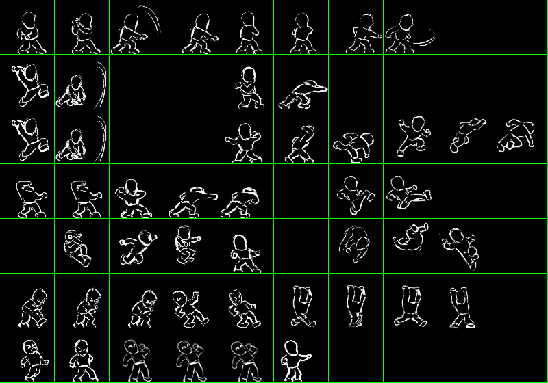

# 空白人参上！——多水平分类预测变量编码

```{r}
#| echo: false
load("data/chapter3_env.RData")  # 继承所有对象
```

在我小学的时候，在同伴中曾经流行过一个游戏。这个游戏中文名有一种跟汉语若即若离的拉扯感，叫《小朋友齐打交2》，英文名是 “Little Fighter 2”。刚刚在网络上搜索了一下，这个游戏的竟然还有留有一个疑似官网（<https://www.lf2.net/>），非常推荐没玩过的读者去试试（不过记得回来看书）。

提到这个格斗游戏的原因是因为，第一，它真的很好玩；第二，它在里面有很多角色，其中有一个角色，我管他（们）叫空白人。下图是我从游戏资源文件夹里直接找到的素材（如有侵权，请联系我删除）。这个空白人跟其他角色的不同点在于，他（们）除了最基础的拳脚之外，搓不出任何其他技能。在色彩缤纷的角色中，这个线条勾勒的角色也显得单调而格格不入。



不过，虽然这么说有点残酷，但在研究设计中，这样一个空白人却是天生的对照组圣体。想想吧，我们现在有机人和袋人，我们想比较他们的魔法天赋，那么我们就需要这么一组人，他们没有自我性别认同，但他们又是人，有基础的其他一切功能和能力。这样，我们就可以单独去看机人和袋人这两种性别自我认同分别对人的魔法天赋有什么影响了。

好，那我宣布我们要在机人和袋人的基础上增加一组空白人进入数据。请看代码：

```{r}
## 生成空白人的对应数据
set.seed(234)
df.blank <- data.frame(ID=c(101:150),iden=c(rep("空白人",50)))
df.blank$magic_score <- rnorm(n = 50, mean = 95, sd = 10)

## 合并空白人数据至我们之前的机人+袋人的数据
df4.1 <- df4 <- rbind(df1,df.blank)

## 看看加进去了没有
tail(df4)
summary(df4)
```

我们再来看看描述统计。

```{r}
#| echo: false
#| warning: false    # 隐藏所有警告
#| message: false    # 隐藏包加载信息
#| fig-responsive: true
#| out-width: "100%"   # 在 HTML 中宽度占可用空间 100%


library(ggplot2)

gg <- ggplot2::ggplot(df4.1, aes(x = iden, y = magic_score, fill = iden)) +
  geom_violin(trim = FALSE, alpha = 0.7) +  # 关闭边缘修剪，设置透明度
  geom_boxplot(width = 0.2, color = "black",
               position = position_dodge(0.9),  # 箱线图与小提琴图对齐
               outlier.shape = NA,  # 隐藏离群点
               show.legend = F) +  # 关闭箱线图图例
  geom_jitter(width = 0.1, alpha = 0.3, color = "black", show.legend = F) +  # 添加数据点
  stat_summary(
    fun = mean, geom = "point",
    shape = 17, size = 5, color = "red",
    position = position_dodge(0.9),
    show.legend = F
  ) +
  scale_color_manual(values = c("#69b3a2", "#ff9f40", "purple")) +
  guides(color = "none") +  # 隐藏颜色图例（与fill图例重复）
  scale_fill_manual(values = c("#69b3a2", "#ff9f40", "purple")) +  # 自定义填充颜色
  labs(title = "三种自我认同人士的魔法天赋数据", x = "自我认同", y = "魔法天赋分数") + 
  theme_minimal() +
  theme(aspect.ratio = 3/1, # 画布高宽比设为2:1（高度是宽度的2倍）
      plot.title = element_text(
        #size = 24,          # 字号
        hjust = 0.5 )) 
  

plotly::ggplotly(gg)
```

好的，数据我们生成完了，接下来就该分析了。我们的研究假设是什么呢？回顾我们在前两章做的事情，显然一个假设可以是：机人、袋人和空白人三组人的魔法天赋存在差异。即

$$\mu_{机人} \ne \mu_{袋人} \ne \mu_{空白人} $$

同样的，我们可以找到我们的零假设，机人、袋人和空白人三组人的魔法天赋都一样，把上面的不等号改成等号就行了。那么，用什么统计分析进行验证呢？

## 三水平因素的方差分析实战 {#sec-onewayanova}

学过方差分析的读者大概根本不用犹豫，这不就是最典型的单因素方差分析吗？是的，我们在上一章中使用了方差分析检验机人和袋人之间是否存在魔法天赋的差异。但是实际的研究和教学中，其实大多数使用的都是三水平以上的自变量作为单因素方差分析的例子，这也是它某种程度上优于t检验的地方——它可以检验多于两组以上的组间差异是否显著。

所以我们现在先做一下方差分析。

```{r}
## 不要在意我的模型和变量命名有什么规律，命名这种事情看心情的
my.aov4.1 <- aov(magic_score~iden, df4.1)
## 我们之后的方差分析会尽量使用car包里的Anova命令报告结果，原因之后会介绍
car::Anova(my.aov4.1)
```

结果很是喜人，方差分析发现了一个显著的差异，即机人、袋人和空白人在魔法天赋上存在显著差异。

不过，显然本书的主要目的不是带读者们重走方差分析路的。我们在上一章说到，本质上方差分析和回归分析都从属于一般线性模型。那么我们能不能用线性回归模型的办法检验我们的假设呢？

## 编码：把类别变量变为连续变量的魔法

使用线性回归分析三组人魔法分数的差异，显然预测变量是一个由这三组人组成的分类变量。而进行分析最大的障碍显然是，如何把这样一个分类变量作为预测变量放进回归模型。其实这个问题我们在上一章的时候就有所涉及，还专门在 @tip-coding1 和 @tip-coding2 与大家一起思考和讨论过。只不过，在上一章中，我们的自我性别认同还只是一个两水平的变量。但现在，这个分类变量因为空白人的插足，变成了三水平的分类变量。我们该怎么办呢？

我们在上一章中的做法，是给机人和袋人分别赋予两个数值，机人=0，袋人=1。最直观的思路，就是顺着这个逻辑再加一个数，比如，空白人=2。这样，行不行呢？我们试试：

```{r}
df4.1$iden_n <- c(rep(0,50), rep(1,50), rep(2,50))
my.lm4.1 <- lm(magic_score~iden_n, df4.1)
summary(my.lm4.1)
```

显然，不行。上一章中，我们比较过回归模型的模型拟合和方差分析的结果应该一致。但显然上面的回归模型的拟合结果的显著性检验 F-statistic: 43.41 on 1 and 148 DF, p-value: 7.296e-10，与我们在 @sec-onewayanova 中得到的结果不一致。那么，问题出在哪儿呢？

在上一章中，当我们在使用这种编码方式的时候，其实我们强调过，两水平变量可以被视为一种特殊的“等距“变量处理，所以它能被赋任意两个不相等的值放入模型。那么，三水平变量改变了什么呢？回到我们的例子，当我们只有机人和袋人两组人时，不管我们怎么赋值，二者都只有一个“距离”，但是当空白人加入这个家庭之后，三者就出现了两两之间的3个“距离”。这三个距离相等吗？显然不相等，或者说，我们根本不知道他们的“距离”是什么，他们在这个时候根本无法被看作是等距变量！所以，机人=0，袋人=1，空白人=2，或者任意什么其他同时给他们仨赋值的其他方式，似乎都在假设他们之间的距离情况，而这种假设是不成立的。

我们在 @tip-coding2 中分析过，不管如何编码两水平分类变量，最终回归模型预测的结果变量都会是机人和袋人的平均魔法天赋分数。那么上面这个模型呢？

```{r}
table(predict(my.lm4.1))
```

跟我们实际数据的平均数比较一下。

```{r}
group_means <- aggregate(magic_score ~ iden, data = df4.1, FUN = mean)
group_means
```

不能说一模一样吧，只能说是毫无关系了。把三组人作为等距变量放进模型，看来导致了模型没能有效地预测三组人的魔法天赋平均数。

显然，我们需要一种新的编码方式。这种编码方式，需要给2水平以上的分类变量施加魔法，让它们能像两水平分类变量一样，作为数值型的变量进入回归模型。

### 哑变量编码 (dummy coding)

从上面的分析我们可以知道，要让回归模型正确地运行，我们首先需要让它的预测值变成每组的。我们不妨再回到两水平变量的情况，重新审视一下它预测的过程。

```{r}
summary(lm1)
```

我们的回归模型是 $\hat y=81.240+14.055x$ 。当x=0时，我们的预测值等于b~0~就是机人的魔法天赋分数均值。而当x=1时, 我们的预测值等于 b~0~+b~1~ （81.240+14.055=95.295）就是袋人的魔法天赋平均分了。

在这个模型的基础上我们缺什么呢？不就是空白人的平均魔法分数吗，我们想想办法怎么能补上呢？

显然，上面用的分别赋值0，1，2的办法不行，因为变量并不等距。分类变量只有在两个水平的时候可以视作等距。那简单啊，我们增加一个变量，想办法让它用空白人跟袋人之间的差值作为它对应的回归系数（b~2~）,也就是 b~0~+b~2~ =89.23953，问题不就解决了吗？

怎么做到这一点呢？照猫画虎，看看机人和袋人是怎么搞的？我们之前设置了一个变量，叫它D~1~ 好了，机人=0，所以变成了截距。袋人=1，就是b1了。那简单，就让另一个变量，叫它D~2~，赋值机人=0，空白人等于1，不就解决问题了吗？

就像下面这张表所列的赋值关系。如果我们分别把D1 和 D2 放入两个回归方程，那其实就等价于我们做了两个独立样本t检验。可问题是我们要检验的不是这两个两组间的差异，我们想检验的是三组间的魔法天赋有没有差异呀。

| 自我性别认同 | D~1~（袋人-机人） | D~2~（空白人-机人） |
|--------------|-------------------|---------------------|
| 机人         | 0                 | 0                   |
| 袋人         | 1                 | \-                  |
| 空白人       | \-                | 1                   |

就像上面分析的，我们需要同时在一个方程中的结果得到，b~0~+b~1~ 和b~0~+b~2~ 分别对应袋人和机人的平均魔法天赋数值。所以关键问题是，把D~1~和D~2~同时放进方程，D~1~中的空白人和D~2~中的袋人应该怎么赋值呢？

我们上面说，我们把两水平的分类变量视作等距变量。现在，我们有了D~1~ 和 D~2~, 我们如果把它们视作两个两水平的变量，分别代表两组人，以此来达到“等距”的效果，显然这时候的赋值就只能在0和1中选择了。那么，给D~1~中的空白人和D~2~中的袋人是选择1还是0呢？

我们不妨回到方程：

$$\hat y= b_0+b_1D_1+b_2D_2$$

那么，对于机人的预测值，也就是机人的平均数，根据上面的表，D~1~=D~2~=0，代入方程中，显然是：

$$\hat y_{机人} = b_0$$ {#eq-dc0}

对于袋人呢，我们不知道D~2~中如何给它赋值，就先用x表示，那么：

$$\hat y_{袋人} = b_0+b_1+b_2x$$

想重复出之前两水平变量的效果，显然让上式中的 x=0 就可以了，即：

$$\hat y_{袋人} = b_0+b_1$$ {#eq-dc1}

同理，对于空白人来说，在D1中对它赋值为0，就可以得到：

$$\hat y_{空白人} = b_0+b_2$$ {#eq-dc2}

看上去我们的目标达成了！新的编码表如下。

| 自我性别认同 | D~1~（袋人-机人） | D~2~（空白人-机人） |
|--------------|-------------------|---------------------|
| 机人         | 0                 | 0                   |
| 袋人         | 1                 | 0                   |
| 空白人       | 0                 | 1                   |

赶紧来试试能不能成功。

```{r}
## 按照编码表生成D1和D2两个变量

df4.1$D1 <- ifelse(df4.1$iden == "某品牌塑料袋", 1, 0)
df4.1$D2 <- ifelse(df4.1$iden == "空白人", 1, 0)

## 加入回归模型分析

my.lm4.2 <- lm(magic_score~D1+D2,df4.1)
summary(my.lm4.2)
```

对比一下我们之前方差分析的结果。

```{r}
car::Anova(my.aov4.1)
```

巧了不是，这不是对上了？这回两个F检验一模一样了。

我们还可以注意一下模型中的回归系数。对比一下我们机人袋人和空白人的魔法天赋分数。

```{r}
group_means
```

截距的估计值显然是机人的魔法天赋分数。b1和b2，也就是D1和D2对应的回归系数呢？其实整理，@eq-dc0 ，@eq-dc1 和 @eq-dc2 。不难推导出：

$$\begin{align}
b_0&=\hat y_{机人}\\
b_1&=\hat y_{袋人}-\hat y_{机人}\\
b_2&=\hat y_{空白人}-\hat y_{机人}
\end{align}$$

看看我们的回归方程结果输出，数值上没错。那么，它们后面对应的，对于系数显著性的检验，检验的是什么呢？谜底藏在谜面上，就是对回归系数数值与0的比较。那么，如果b1不等于0,意味着什么呢？袋人的魔法天赋平均数不等于机人的。同理，b2的显著性检验，检验的就是空白人和机人之间的魔法天赋存不存在显著差异。

注意这个结果跟我们在第二章中，@sec-t检验实战 的结果，尽管数值看上去很接近，但并不一样。

```{r}
t.test(magic_score~iden, df1.1, var.equal = TRUE)
```

我们上面提到的使用b1的显著性对机人和袋人的比较，是考虑了空白人的数据的前提下，比较机人和袋人的魔法天赋的差异。如果有同学在方差分析中学过对应的知识，就会知道，这实际上就是一种事前比较（planned contrast）检验。

::: {#tip-planned-posthoc .callout-note icon="false"}
## 引申：事前比较是对单因素方差分析的结果的进一步检验吗？事后比较呢？

因为很多统计教育的流程和实际做法往往是这样的。先教或者先做单因素方差分析，然后再教或者再做水平间的比较。所以我自己以前，包括也知道一些人会觉得，方差分析是开始一切分析的起始点。做完方差分析之后，我们再开始进一步分析它的结果。比如我们上面找到的机人、袋人和空白人在魔法天赋上的显著差异，我们可以进一步了解机人和袋人之间有没有差异，袋人和空白人之间有没有差异，机人和空白人之间有没有差异。

上面的几个问题，不就是我们用哑变量编码能检验的假设吗？而且，哑变量编码构成的编码变量组合之后也确实能对三组人魔法天赋是否存在差异进行检验。那么，这是不是说明这几个事前比较合在一起就是单因素方差分析，我们在得到方差分析的显著结果之后就可以用这几个检验进一步阐释方差分析的结果呢？

统计学的好的读者的第一反应肯定是，不，这么做是不对的。在得到了显著的方差分析结果之后，我们应该做的是事后比较（post-hoc test）而不是事前比较呀。

那么，事后检验是对单因素方差分析结果的进一步检验吗？

从流程上来说，是的。从事前事后这两个术语来看[^chap4-1]，事后检验本身就是在方差分析之后进行的，这就是“事后”的意思。这也是实证研究中合理的需求，当我们发现一个多水平的单因素方差分析显著以后，以我们人类习惯的认知方式，通常想要知道各水平之间的具体差异如何，而不会满足于知道各个水平之间有差异就行。这时候我们的“进一步”检验就是事后检验。

统计学的好的同学大概又有话说了，不对啊，事后检验最大的特点不是控制一类错误率吗？

确实。其实这个问题有点鸡生蛋蛋生鸡的味道，不过从逻辑上来说，事后检验其实并不是非得控制一类错误。因为有个事后检验叫LSD（Least Significance Difference）,它是一个对t检验的变形。变形在哪呢，我们都知道t检验的t分数分子是平均数差异，分母是抽样分布的SE。平均数差异就不说了，比如机人减袋人，很好算。像我们这样多水平的单因素检验，SE就要考虑另一组（比如空白人）的情况，所以LSD里的SE就是 $SE = \sqrt{MS_{组内}(\frac{1}{n_i} + \frac{1}{n_j})}$，你也可以把独立样本t检验看成它的一种特殊形式，本质就是使用三组或更多组的数据去找到一个共同的SE。那么它算出来是多少呢？

```{r}
DescTools::PostHocTest(my.aov4.1,method="lsd")
```

比较一下我们上面得到的哑变量编码的结果，发现什么了吗？是的，p值是一样的。一方面，我们在这里又不经意摸了大象一把，看到了LSD这种t检验和线性回归以及方差分析之间的共性。另一方面，这也回答了我们在这个模块上面问的问题，我们做的事前比较相比独立样本t检验，相当于多考虑了其他组带来的SE。

等等，我们不是在讨论事后比较吗？怎么又绕回事前去了。恭喜你发现了华点，LSD确实跟事前比较所有可能的两组差异本质上是同一个检验，区别仅在于它们是不是在方差分析检验之后再做的而已。

说事后比较或者事后检验的特点是控制一类错误的说法也不能说是错的。因为LSD确实是一个只存在于介绍中而实证早就抛弃的方法。因为它没有控制一类错误（相关概念以及下面提到的统计功效请参看 [番外一](#sec-ecI) ）。那么，为什么要控制一类错误呢？

拿我们的例子来说，当我们知道三组人魔法天赋有差异之后。如果做LSD,就是单独做了三个t检验。只考虑这三个t检验，每个检验都使用0.05的alpha水平，那么在这么一个研究中，我们实际的alpha水平是多少呢？

```{r}
1-0.95^3 #三个检验都没有犯一类错误的预设概率是0.95^3
```

考虑到我们期望的水平是0.05,这已经翻了三倍了。如果你的水平数更多呢，注意我们的水平数可是放在幂指数上的。所以这是一个事后检验会遇到的严重的问题，多次假设检验而不控制一类错误会极大的增加我们犯一类错误的概率。所以我们在这种需要做很多次假设检验的常见情况下，也就是事后检验里，控制一类错误是必然也必要的[^chap4-2]。

事后检验的方法这么多的原因也在于此，控制一类错误是必要的，但怎么控制能权衡好多次检验放大的一类错误率和严格控制减少的统计功效。我不想在事后检验着墨太多，因为这既没有标准答案，也不是本书的主旨。下面我们介绍一种我所知道的最严格但也最直观的事后检验方法，Bonferoni。这个方法的逻辑很直观，既然同时做n个检验会放大一类错误率，那我直接限制住alpha水平，把0.05平均分给这n个检验。每个检验的alpha水平是0.05/n,这事儿不就平了吗。

我们也可以再按上面的方式算一次。确实大概控制在0.05附近了，确实也很严格，但谁家好人做999次检验对吧。所以一般我们做Bonferoni事后检验是最能堵住别人嘴的方式了。

```{r}
1-(1-0.05/3)^3
1-(1-0.05/9)^9
1-(1-0.05/99)^99
1-(1-0.05/999)^999

```

好，我们看下实战。

```{r}
DescTools::PostHocTest(my.aov4.1,method="bonferroni")
```

检验呈现的结果，实际上是对p值做了修正，不过本质是等价的。这个我们在第二章单尾和双尾的p值问题时讨论过。实际上，把上面LSD的结果乘以3（我们的例子里是三次检验），结果就和Bonferoni事后检验结果一致了。

```{r}
DescTools::PostHocTest(my.aov4.1,method="lsd")$iden[,"pval"]*3
DescTools::PostHocTest(my.aov4.1,method="bonferroni")$iden[,"pval"]
```

好了，我们说回事前比较，那么，事前检验就是在方差分析之前做的比较吗？

并不是的。我们需要思考一个问题，机人和袋人之间存在差异，是三组人存在差异的一部分吗？它们有先后关系吗？或者换句话说，要知道机人和袋人之间存在差异，是不是一定要知道三组人之间是否存在差异？如果世界上只有机人、袋人和空白人，我手头有这三组人的数据，但我只关心机人和袋人之间的差异可不可以？

在统计上，或者数理上，当然三组之间存在差异，和其中两组之间存在差异是有关的。但是，别忘了，我们的研究是在检验我们的假设。从这个角度上说，事前比较和方差分析都是在对假设使用统计进行检验。它们之间也许彼此纠葛牵一发而动全身，但归根到底回到我们的研究里，我们要关注的是我们的假设是什么，以及我们怎么检验。从这个角度上说，事前比较不是方差分析的附属，事前比较可以在方差分析之前做，也可以在方差分析之后做，不做方差分析只做事前检验更是大大的可以。关键在于，你的事前检验是不是在检验你基于理论和研究本身提出的假设。而不是在方差分析结果显著之后，才想起需要用这种方法解释方差分析的结果。
:::

[^chap4-1]: 虽然事前事后这种说法给我的感觉透露着一股渣的气质，但是这个术语的翻译一直是这样的。

[^chap4-2]: 如果你问，为什么像相关矩阵表这种东西里面那么多相关的显著性检验不控制一类错误率呢？好问题，但我建议你下回别问了，至少别问我。我只能回答你，这就是理想和现实的参差。

是的，我们通过上面的分析，其实一起推导出了如何对多水平分类变量进行哑变量编码（dummy coding）。对于一个大于两个水平的分类变量来说，我们没有办法只使用一个变量对它进行编码。所以，对于随便一个多水平分类变量，假设它有k个水平，那么我们需要k-1个变量对它进行编码。

::: {.callout-note icon="false"}
## 引申：为什么是k-1

也许有读者会问，我们上面推导的是用两个编码变量编码一个3水平的分类变量，也没说不能用三个编码变量编码呀？其实我们不妨这么思考，三个水平对应三个组平均数，要分别用方程中的所有回归系数（包括截距）指代。可以看作，所有组平均数已知，而回归系数未知的方程组求解，也就是我们上面列出的：$\hat y_{机人} = b_0; \hat y_{袋人} = b_0+b_1; \hat y_{空白人} = b_0+b_1$ 。如果你再加入一个变量，就会新增一个变量的回归系数，变成三个式子求解四个未知数了。换句话说，因为截距已经使用了一个信息，所以只剩下两个信息可以给编码变量编码使用了，是不是跟自由度的概念差不多？

我们其实可以从零假设的角度再间接理解一下。想想一个三水平因素的方差分析检验的零假设是什么？

$$
\mu_{机人}=\mu_{袋人}=\mu_{空白人}
$$

没错吧？那么再回想一下我们在t检验时是如何把它转换成一个可以构建出来的抽样分布？

$$
\mu_{机人}-\mu_{袋人}=0
$$

这个时候，我们就可以基于这个平均数之差，作为一个已知其抽样分布形态的数据去做零假设检验了。那么上面的三个变量构成的等式，我们把它们都写成这种形式：

$$
\mu_{机人}-\mu_{袋人}=0\\
\mu_{机人}-\mu_{空白人}=0\\
\mu_{袋人}-\mu_{空白人}=0
$$

注意力惊人的读者应该已经看出来了，下面两个等式合并之后，就是：

$$
\mu_{机人}-\mu_{空白人}=\mu_{袋人}-\mu_{空白人}=0
$$

整理一下其实就是第一个等式！

所以其实三个水平相等这个零假设，转换成平均数差异以后，只需要知道两对两水平相等，第三对水平自然就是相等的了。换句话说，如果袋人和空白人一样，机人和空白人一样，那机人和袋人肯定也一样。

那么这两对水平平均数之差的检验，不就是对应着我们哑变量编码的两组对比吗？
:::

这些对它进行编码的变量，在本书中我们叫它编码变量（或者构造变量）。而哑变量编码的方法，就是在k个水平中选择一个水平，所有编码变量对这个水平的赋值均为0,剩下的其他水平，每个编码变量对其中的一个水平赋值为1且不重复。用文字表达还挺难理解的，我们可以看表：

| 分类变量 | D~1~ | D~2~ | …   | D~n-1~ |
|----------|------|------|-----|--------|
| A        | 0    | 0    | …   | 0      |
| B        | 1    | 0    | …   | 0      |
| C        | 0    | 1    | …   | 0      |
| …        | …    | …    | …   | …      |
| N        | 0    | 0    | …   | 1      |

其实不难发现，我们在进行哑变量编码时，那个所有编码变量都赋值为0的水平，就是那个被我们安排到截距的倒霉蛋。而剩下的每个编码变量，都是在检验自己赋值为1的那个水平，跟截距对应的那个水平的平均数差异是否显著。换句话说，截距对应的这个变量，通常来说我们会放的就是变量中适合作为对照组的水平，我们也把这个水平叫做基线水平（baseline level）。

不过视线回到这章的一开头，我们加入了空白人这个先天对照组圣体，显然不是为了让它占据D2。所以接下来，我们把它放到截距的位置发光发热，看看结果如何。

首先，我们再重新画一个编码表。

| 自我性别认同 | D~1~（袋人-空白人） | D~2~（机人-空白人） |
|--------------|---------------------|---------------------|
| 机人         | 0                   | 1                   |
| 袋人         | 1                   | 0                   |
| 空白人       | 0                   | 0                   |

然后生成新的编码变量，并进行回归分析。

```{r}
## 按照编码表生成D1n和D2n两个变量

df4.1$D1n <- ifelse(df4.1$iden == "某品牌塑料袋", 1, 0)
df4.1$D2n <- ifelse(df4.1$iden == "武装直升机", 1, 0)

## 加入回归模型分析

my.lm4.3 <- lm(magic_score~D1n+D2n,df4.1)
summary(my.lm4.3)
```

结果不出意料，模型的拟合情况一致。D2和D2n两个编码变量的结果，除了系数本身的符号因为对照组不同而相反之外，绝对值和显著性检验的结果也一致。D1n的估计值也与袋人和空白人的魔法天赋平均数之差一致。而根据这一结果，考虑到空白人的种族特性[^chap4-3]，说明自我认同为机人会降低人的魔法天赋，而自我认同为袋人似乎并不会相比基线水平增加人的魔法天赋。虽然是我自己生成的数据，但这是一个很有意思的结果，不是吗？

[^chap4-3]: 好吧，我们假定我们把空白人设定为一种特殊的种族，而他们的自我性别认同是空白。

简而言之，使用哑变量编码进行回归分析，可以在检验单因素方差分析检验的结果的同时，使用回归系数进行变量间水平的两两事前比较。

::: {#tip-dcal .callout-tip icon="false"}
## 思考：如果不把D~1~中的空白人或D~2~中的袋人赋值为0会发生什么？

如题，如果我们不按照哑变量要求的编码会发生什么呢？我们不妨做一个小改动，把编码表改成如下的形式。

| 自我性别认同 | D~1~ | D~2~ |
|--------------|------|------|
| 机人         | 0    | 0    |
| 袋人         | 1    | 0    |
| 空白人       | 1    | 1    |

实现代码我也慷慨地写好了。

```{r}
df4.1$R1 <- c(rep(0,50),rep(1,50),rep(1,50))
df4.1$R2 <- c(rep(0,50),rep(0,50),rep(1,50))
my.lm4.4 <- lm(magic_score~R1+R2,df4.1)
summary(my.lm4.4)
```

那么问题是，这两个回归系数检验的是什么呢？聪明的读者不妨自己计算验证一下。
:::

### 效应编码 (effects coding)

虽然我们在本章的一开头在我们的魔法世界宇宙中设定了空白人是一种先天对照组圣体。然而，世事不会尽如人意。正如我们会讨论机器人或人工智能在觉醒了意识后，我们应该如何处理他们的个体权利问题一样；魔法世界中的空白人有一天突然觉醒了，他们向世界宣告，他们不认为自己的空白自我性别认同是”性空“。相反，他们认为他们的空白自我性别认同是实在的，具体的，是一种“有”。所谓“菩提本无树，明镜亦非台”，“无”本身就是一种“有”，而不是“空”。

好吧，用大白话来说就是，他们觉得空白不是没有自我性别认同，而是自我性别认同的一种。这些卑鄙的空白人，他们破坏了我们研究的对照组！

虽然以上是开玩笑，但这个例子也想揭示，很多时候，特别是当我们使用的是现实生活中存在却极难修改的变量时[^chap4-4]，很难找到一个合适的且有足够数量的对照组。那么有没有什么办法，能让我们检验空白人或其他两组人相比于这三种自我性别认同人一般魔法天赋的情况呢？

[^chap4-4]: 最典型的例子就是生理性别、族裔、国籍等等人口统计学变量了。

相信有读者已经想到了，所谓的一般情况，不就是平均情况吗？那比较每组人的平均魔法天赋和三组人的总平均魔法天赋之间的差异不就行了？其实认真想想，在方差分析中，使用的组间变异（各组平均数减总平均数的平方和），不就是这个思路吗？

我们在哑变量编码中，实际上是把自我性别认同对魔法天赋的效应拆成了这样的形式：

b0：空白人平均魔法天赋

b1：空白人平均魔法天赋+（袋人-空白人的魔法天赋）

b2：空白人平均魔法天赋+（机人-空白人的魔法天赋）

那么我们能不能转变思路，把基线水平换成三组人的总平均数，即：

b0：总平均魔法天赋

b1：总平均魔法天赋+（袋人-总平均魔法天赋）

b2：总平均魔法天赋+（机人-总平均魔法天赋）

这样，我们不就可以通过检验回归系数来看袋人和机人相对于三族人的平均水平而言，他们二者的魔法天赋情况了吗？[^chap4-5] 回顾我们的哑变量编码，是这样的：

[^chap4-5]: 是的，因为空白人搞事情坏了我们的大事，所以我们不带他们玩了，去总平均里充当分母去吧。

$$\begin{align}
b_0&=\hat y_{机人}\\
b_1&=\hat y_{袋人}-\hat y_{机人}\\
b_2&=\hat y_{空白人}-\hat y_{机人}\\
\end{align}$$

那么我们的新编码情况，就是：

$$\begin{align}
b_0&=(\hat y_{机人}+\hat y_{袋人}+\hat y_{空白人})/3\\
b_1&=\hat y_{袋人}-(\hat y_{机人}+\hat y_{袋人}+\hat y_{空白人})/3\\
b_2&=\hat y_{机人}-(\hat y_{机人}+\hat y_{袋人}+\hat y_{空白人})/3
\end{align}$$ {#eq-effect}

现在的问题是，我们怎么找到对应的编码表，生成编码变量呢？很简单，在哑变量编码中，我们是已知编码，来看我们的斜率的实际意义；把组平均数看成了已知常数，求解三个回归系数的解。现在我们反过来，把三个回归系数当作常数，求解三个组平均数的解即可。由上面的式子，不难得到[^chap4-6]：

[^chap4-6]: 虽然我调侃过这事。不过我强烈建议读者们在这一章，拿出纸笔自己认真推导一遍我们使用的所有编码，理解平均数和回归系数之间如何在线性模型中对应，并为我们所用检验假设的。甚至，我建议大家如果将来使用这种方法检验假设时，用这个办法推导一遍，保证回归系数检验的确实是你要的假设。 比如我们这次的推导，把第一个式子代入后两个式子，得到：

$$\begin{align}
b_1&=\hat y_{袋人}-b_0\\
b_2&=\hat y_{机人}-b_0
\end{align}$$

再将机人和袋人平均数代回第一个式子得到，

$$ b_0=(b_0+b_2+b_0+b_1+\hat y_{空白人})/3 $$

三个平均数对应回归系数的关系就求解出来了。是不是不难得到呢？

$$\begin{align}
\hat y_{袋人}&=b_0+b_1\\
\hat y_{机人}&=b_0+b_2\\
\hat y_{空白人}&=b_0-b_1-b_2
\end{align}$$

那么，编码表应该长什么样呢？根据上面的式子，假设我们生成的两个编码变量叫E1和E2，那么E1对应b1的赋值，E2对应b2的赋值。这样的话，我们就能用这两个虚拟编码在回归模型中预测出对应的平均数。即，如下的编码表。大家也可以用下面的编码表代入回去重新检验一遍是不是能推导出上面的回归系数的式子。

| 自我性别认同 | E~1~ | E~2~ |
|--------------|------|------|
| 机人         | 0    | 1    |
| 袋人         | 1    | 0    |
| 空白人       | -1   | -1   |

上面的编码方式就是我们的效应编码（effects coding；也叫偏差编码，deviation coding）。简单总结，这种编码方式同样需要找到一个基线水平，在哑变量编码中，我们把这个水平在所有编码变量上都赋值为0，在效应变量编码中，我们把这个赋值改为-1就可以了。

我们再实战检验一下。

```{r}
## 按照编码表生成E1和E2两个变量

df4.1$E1 <- ifelse(df4.1$iden == "某品牌塑料袋", 1, 
                   ifelse(df4.1$iden == "空白人",-1,0))
df4.1$E2 <- ifelse(df4.1$iden == "武装直升机", 1, 
                   ifelse(df4.1$iden == "空白人",-1,0))

## 加入回归模型分析

my.lm4.5 <- lm(magic_score~E1+E2,df4.1)
summary(my.lm4.5)
```

模型拟合的情况还是跟之前的哑变量编码一样，我们就不重复了。我们来检验一下系数是否是我们期望的机人和袋人与总平均水平之间的差异。看上去没啥毛病对吧，E1和E2分别对应袋人和机人与总平均魔法天赋之间的差值。

```{r}
mean(df4.1$magic_score)
group_means
```

而对E1和E2的回归系数检验结果说明，机人和袋人相比于三组人的平均水平，魔法天赋都有差异。不过需要注意的是，一般来说这种使用总平均作为对照基线的效应编码，在进行解读时一定要考虑到你的基线是什么。比如你研究的是三个国家的情况，那么你的基线仅是这三个国家的平均情况，而不是“全世界“的平均情况。请体会一下差别。

还有读者可能会问，那空白人的结果呢？答案是，你可以调整编码表，换一个基线水平呀。

### 对比编码 (contrast coding)

可能还有读者会问了，除了哑变量编码和效应变量编码，还有其他的编码方式吗？有的有的，亲，还有的。我们接下来就给您上架一款特别百搭非常显瘦的编码神器——对比编码(contrast coding)。

我们在介绍哑变量编码的时候说过，它的每个编码变量都可以看作是一个针对分类变量中两个水平间差异的事前比较。那么熟悉事前比较这个概念的同学可能就有疑惑了，事前比较不止能比较两个水平啊，比如我们可以通过事前比较检验机人和袋人两个组和空白人单独一个组之间魔法天赋的差异，那这时候怎么办呢？所以我们这边就给亲们推荐的是这款对比编码了。

可能有不熟悉事前比较概念的读者对“机人和袋人两个组和空白人单独一个组之间魔法天赋的差异“这个说法有一些疑惑。从概念上来说，我们可以假设一种情况。在我们这三种人生存的平行宇宙里，机人和袋人主要是由一种类似泛灵论的宗教衍生发展而来的一种世俗文化带来的自我性别认同。他们的性别认同建立在找到现实中具象的意象并产生灵性链接，进而形成自我认同。而空白人呢，则是二刺螈文化下诞生的一种性别认同。即他们从本质上认为人的心理诞生于虚无，试图从根源上驱逐无关的文化意象，寻找需要形成自我性别认同的最简本源，对他们来说，这就是“空白”。[^chap4-7] 那么，作为研究者，自然就想比较这两类不同来源的自我性别认同，是否会对个体的魔法天赋产生不同的影响。

[^chap4-7]: 以上都是胡诌的，别当真。

那么，在数理上，我们怎么理解这样一种假设呢？在比较两组假设时，我们的研究假设是：

$$\mu_{机人} \ne \mu_{袋人}$$

照猫画虎，我们想比较机人和袋人与空白人的差异。算一个机人和袋人的“平均值“代表他们，再跟空白人比，我们的假设就可以写成[^chap4-8]：

[^chap4-8]: 注意，这时我们在讨论的都是总体平均而非样本平均。所以思考时不用考虑样本大小与加权的问题。

$$\frac{\mu_{机人} + \mu_{袋人} }{2}- \mu_{空白人} \ne 0$$

有些研究者觉得这样带着分数写很难看，所以会把不等式两边都乘以2,就变成了：

$$\mu_{机人} + \mu_{袋人} - 2\mu_{空白人} \ne 0$$

以此类推，就可以得出一个多水平的事前比较的假设的通用形式：

$$L=w_1\mu_1+w_2\mu_2+...+w_k\mu_k\ne0$$

比如我们刚才的假设，就是 $w_1=1,w_2=1,w_3=-2$ 。等等，这个写法，是不是有点眼熟呢？我们回去看看之前哑变量和效应编码的编码表，每个编码变量不也是与每组的均值相乘运算吗？我们是不是可以把这组赋值直接作为编码的值，比如下表？

| 自我性别认同 | C~1~ | C~2~ |
|--------------|------|------|
| 机人         | 1    | \-   |
| 袋人         | 1    | \-   |
| 空白人       | -2   | \-   |

这里多说一句，你也可以使用一个$w_1=\frac{1}{2},w_2=\frac{1}{2},w_3=-1$ 这样的编码，本质上表示的是一个意思。推荐读者不妨用这个编码再进行一下下面的推导，看看优缺点分别是什么。

那么，另一个编码变量应该如何编码呢？比如，按照我们之前的假设，我们还想看看机人和袋人作为一个文化组内部的性别认同，有没有什么差异，这时候我们就不关心空白人了。即：

$$\mu_{机人} - \mu_{袋人} - 0\mu_{空白人} \ne 0$$

对应 $w_1=1,w_2=-1,w_3=0$ ，编码表补完：

| 自我性别认同 | C~1~ | C~2~ |
|--------------|------|------|
| 机人         | 1    | 1    |
| 袋人         | 1    | -1   |
| 空白人       | -2   | 0    |

::: callout-tip
## 思考：一个没想好题目的关于事前事后比较的讨论

我们在 @tip-planned-posthoc 讨论了事前比较和事后比较之间的差别，以及什么情况下可以使用事前比较，什么时候使用事后比较。现在，我们在初步介绍了对比编码后，显然我们的事前比较的武器库就更丰富了。任何多水平分类变量下，各水平的均值比较都可以在这个框架里完成了。

不过，我们在这里要讨论的问题不是这个。而是一个在某社交平台看到的帖子[^chap4-9]，大致说的是有一个研究，自变量有5个水平，1个控制组（比如我们叫它A）和4个实验组（我们叫它们BCDE）。帖子里的问题是，如果研究者只关注控制组与剩下每个实验组之间是否存在差异，是不是可以做四次独立样本t检验就行呢？

聪明的读者，不妨在这里停顿一下想一想，这么做是不是可以。

从研究设计的角度，我个人一开始的思考是认为没问题的。不过不可否认的是，这么做检验一类错误率确实没控制好。这个其实是一个很灰色地带的问题，因为实证研究里很多时候像一些简单效应检验做四个不控制一类错误的也很常见。但是更好（或者说更能说服人）的办法是使用比如我们之前提到过的 Bonferoni 之类的办法对一类错误进行控制，让它变成一种“事后”检验。所以大家可以看到，虽然我们说，在道理上，你的研究假设应该用事前检验进行检验，但是现实里还是可能需要用事后检验的方法对太多次的事前检验进行一类错误控制。

不过可能这个部分想要讨论的问题并不是主要关注这个。上面我们描述了一个使用了 Bonferoni 控制一类错误的“事后检验”。ABCDE五个组，对A-B,A-C,A-D,A-E这四个比较做了控制。那么，如果这真是一个统计检验结果的事后检验，原检验会是什么呢？

我们不妨来思考一下，我们一般说的单因素方差分析的事后检验，是对一个显著的单因素方差分析的结果进行进一步的分析。比如我们上面的例子，当我们的单因素方差分析发现ABCDE五个组之间存在显著差异后，就可以进行事后检验。那么，事后检验分析的是哪些均值比较呢？我们列一下：

A-B，A-C，A-D，A-E，B-C，B-D，B-E，C-D，C-E，D-E。

简单来说，就是穷举这个因素内任意两个水平间的均值差，检验其是否显著。

那么，我们上面所说的A-B,A-C,A-D,A-E，这四个比较组合在一起的控制了一类错误的检验，如果它们合在一起是一个统计检验的事后检验，是否也就是穷举了那个检验中所有需要检验的水平间的均值差呢？那么，有没有这样一个检验呢？

抬头往上看看，前面就有一个呀。针对ABCDE,如果我们的对比编码是（4,-1,-1,-1,-1），能不能把上面那四个均值差，看作是这个事前对比的两两均值差穷举呢？

好了，那么我真正的问题就来了。对于我们一开始提到的那个研究。研究者可以只关注控制组与剩下每个实验组的两两比较吗？你认为是不是应该先做我们上面这个（4,-1,-1,-1,-1）的检验，再展开两两比较呢？
:::

[^chap4-9]: 感谢李喻骏博士提供的素材。

我们再实战检验一下。

```{r}
## 按照编码表生成C1和C2两个变量
## 这里我偷懒了，直接改的效应编码的代码，没什么逻辑

df4.1$C1 <- ifelse(df4.1$iden == "某品牌塑料袋", 1, 
                   ifelse(df4.1$iden == "空白人",-2,1))
df4.1$C2 <- ifelse(df4.1$iden == "武装直升机", 1, 
                   ifelse(df4.1$iden == "空白人",0,-1))

## 加入回归模型分析

my.lm4.6 <- lm(magic_score~C1+C2,df4.1)
summary(my.lm4.6)
```

检验一下，均值差异。

```{r}
group_means
compr_value1 <- group_means[group_means$iden=="某品牌塑料袋","magic_score"]+group_means[group_means$iden=="武装直升机","magic_score"]-2*group_means[group_means$iden=="空白人","magic_score"]
compr_value1
```

嗯？怎么不对？我们不妨像上面求解效应编码一样，也看看我们的对比编码的求解结果是什么。

$$\begin{align}
\hat y_{袋人}&=b_0+b_1+b_2\\
\hat y_{机人}&=b_0+b_1-b_2\\
\hat y_{空白人}&=b_0-2b_1+0b_2
\end{align}$$

易得，

$$\begin{align}
b_0&=(\hat y_{机人}+\hat y_{袋人}+\hat y_{空白人})/3\\
b_1&=(\hat y_{机人}+\hat y_{袋人}-2\hat y_{空白人})/6\\
b_2&=(\hat y_{机人}-\hat y_{袋人})/2
\end{align}$$ {#eq-contrast}

看来，计算中会有一个分母，我们把得到的差值除以分母，结果就一样了。

```{r}
compr_value1/6
```

检验回归系数是否不等于0,可以在两边同时乘以一个常数，所以分母的常数并不影响显著性检验。到这里，似乎我们就学会对比编码了。只要根据假设为每个水平的组平均数赋予不同的编码w,然后把它们转换成编码变量放进回归方程就行了。真的这么简单吗？

我们不妨再试一个例子，在这个例子里，我们不关心机人和袋人之间的组间差异，而是关注空白人和袋人之间的差异。编码表如下：

| 自我性别认同 | C~1~ | C~2~ |
|--------------|------|------|
| 机人         | 1    | 0    |
| 袋人         | 1    | 1    |
| 空白人       | -2   | -1   |

实战一下：

```{r}

## 接着偷懒，C1没变，所以只改C2的编码为C2n

df4.1$C2n <- ifelse(df4.1$iden == "武装直升机", 0, 
                   ifelse(df4.1$iden == "空白人",-1,1))

## 加入回归模型分析

my.lm4.7 <- lm(magic_score~C1+C2n,df4.1)
summary(my.lm4.7)
```

咦？为什么C1的系数变了？明明没有改变它的编码啊？

我们只好开始快乐的解方程吧：

$$\begin{align}
\hat y_{袋人}&=b_0+b_1+0b_2\\
\hat y_{机人}&=b_0+b_1+b_2\\
\hat y_{空白人}&=b_0-2b_1-b_2
\end{align}$$

在这里再鼓励大家一次，请一定要自己试试这个推导过程，理解这里面的计算，方便自己以后的推导。推导后得到：

$$\begin{align}
b_0&=(\hat y_{机人}+\hat y_{袋人}+\hat y_{空白人})/3\\
b_1&=(2\hat y_{机人}-\hat y_{袋人}-\hat y_{空白人})/3\\
b_2&=\hat y_{袋人}-\hat y_{机人}
\end{align}$$

乱了，全乱了。是不是我推导错了，我们用平均数检验一下。

```{r}
group_means
compr_value2 <- 2*group_means[group_means$iden=="武装直升机","magic_score"]-group_means[group_means$iden=="某品牌塑料袋","magic_score"]-group_means[group_means$iden=="空白人","magic_score"]
compr_value2/3
```

看来，数学是不会骗人的。我们的C1编码希望检验，机人和袋人与空白人的差异，但结果检验了机人与袋人和空白人之间的差异。为什么会这样呢？

#### 编码变量的正交性

这就涉及到对比编码的另一个要求了，编码变量之间要正交（orthogonal）。那么什么是正交呢，我们用下面的编码表来理解。

| 分类变量水平 | C~1~ | C~2~ | … | C~i~ |   |
|----|----|----|----|----|----|
| A~1~ | w~11~ | w~21~ | … | w~i1~ | $\prod_{i=1}^{n-1}w_{i1}$ |
| A~2~ | w~12~ | w~22~ | … | w~i2~ | $\prod_{i=1}^{n-1}w_{i2}$ |
| A~3~ | w~13~ | w~23~ | … | w~i3~ | $\prod_{i=1}^{n-1}w_{i2}$ |
| … | … | … | … | … | … |
| A~j~ | w~1j~ | w~2j~ | … | wij | $\prod_{i=1}^{n-1}w_{ij}$ |
|  | $\sum^{n}_{j=1}w_{1j}=0$ | $\sum^{n}_{j=1}w_{2j}=0$ | … | $\sum^{n}_{j=1}w_{ij}=0$ |  |

最下面那一行，描述的就是我们先前推导出的第一个要求。从平均数的角度构建符合我们事前比较的编码，要求相加为零（比如，不管是1/2+1/2-1,还是1+1-2,都等于0）。

最后一列呢，那个像南天门一样的符号是圆周率代表希腊字母π的大写形式，表示连乘。即分类变量每个水平所有编码变量的赋值相乘得到的值。要任意两个编码变量正交，每个水平也就是编码表中每一行连乘得到的结果，相加等于0[^chap4-10]。

[^chap4-10]: 我不知道这样的误解多不多，很多人在讲正交性的时候，似乎会说不管你有几个编码变量，只要它们满足每个水平（也就是编码表中的每一行）的连乘结果相加等于0即可。但至少在我们当前使用对比编码直接放入线性模型中进行比较的办法里，这样是不行的。一个典型的反例是重复对比（repeated contrast），我们后面会提到它的编码形式。

    如果你学过线性代数，使用矩阵来理解就容易很多。但是我猜你如果学过线性代数应该不会来看这本书吧，远目。反正我现在还不会线性代数。

我们回到我们的例子中，第一个成功的编码表，就是一个满足正交条件的编码。

| 自我性别认同 | C~1~ | C~2~ |          |
|--------------|------|------|----------|
| 机人         | 1    | 1    | 1\*1=1   |
| 袋人         | 1    | -1   | 1\*-1=-1 |
| 空白人       | -2   | 0    | -2\*0=0  |
|              |      |      | 1-1+0=0  |

我们可以回到计算的过程来理解正交的优点。我们之前列过如下的式子

$$\begin{align}
\hat y_{袋人}&=b_0+b_1+b_2\\
\hat y_{机人}&=b_0+b_1-b_2\\
\hat y_{空白人}&=b_0-2b_1+0b_2
\end{align}$$

对于C1对应的b~1~来说，我们想检验的是机人+袋人-2空白人的均值。那么，我们直接把前两个式子相加之后，减去2\*第三个式子，就能得到：

$$\hat y_{机人}+\hat y_{袋人}-2\hat y_{空白人}=6b_1$$

而对比我们第二次编码，编码表如下：

| 自我性别认同 | C~1~ | C~2~ |          |
|--------------|------|------|----------|
| 机人         | 1    | 0    | 1\*0=0   |
| 袋人         | 1    | 1    | 1\*1=1   |
| 空白人       | -2   | -1   | -2\*-1=2 |
|              |      |      | 0+1+2=3  |

显然，这个编码并不正交。而在计算上

$$\begin{align}
\hat y_{袋人}&=b_0+b_1+0b_2\\
\hat y_{机人}&=b_0+b_1+b_2\\
\hat y_{空白人}&=b_0-2b_1-b_2
\end{align}$$

我们像上面那样计算，得到的是

$$\hat y_{机人}+\hat y_{袋人}-2\hat y_{空白人}=6b_1+3b_2$$

换句话说，我们通过计算就可以看出来，我们向检验的假设所对应的编码，在正交的情况下，与这个编码变量本身无关的其他编码变量的相关系数并不会来“捣乱”。而在非正交的情况下，对应的平均数乘以编码加减，无法去掉其他非正交编码对应的回归系数（比如上式中的b2），而导致它没有办法对我们的假设直接进行检验。

或者换一个更直观的说法，我们其实之前说过一个概念，就是回归模型的一个假设是残差和模型预测变量彼此独立。这里我们说的正交就是两个变量彼此独立的具体体现。要想让对比编码发挥它本身的作用，就要摆脱其他编码变量跟它我中有你你中有我的关系。

比如我们上面的例子中，最直观的理解就是，C1对应检验的是机人+袋人与空白人之间的差异。而C2检验的是袋人和空白人之间的差异。它跟C1的假设显然不是彼此独立的，袋人和空白人的差异显然有一部分包含在了机人+袋人与空白人的差异里。这两个变量不清不楚的关系，彼此互相纠缠，干扰了我们的检验！[^chap4-11]

[^chap4-11]: 所以，亲爱的读者们，做人做事就是要干净磊落，不能乱搞人际关系，不然就是害人害己啊。（看看，这就是在统计书里做课程思政的实力）

所以，当我们要使用对比编码进行事前比较的假设检验时，如果你是直接使用线性回归，那么你需要保证你的编码变量两两间彼此正交（独立）。

::: {.callout-tip icon="false"}
## 思考：如何找到正交编码，它有几种形式？

相信很多读者看到编码变量的正交要求头都大了。你告诉我编码变量要正交性挺容易的，但是等我生成我假设要的编码变量以后，还要我找到跟它正交的变量，这得费我多少脑细胞啊？

不过我有很多好消息告诉你。第一是，虽然事前比较这个工具很灵活，但是在实证研究中我还真没怎么见过（笑）。很多人会通过事后检验间接地说明他们想做的事前检验。比如机人和袋人分别跟空白人差异显著，机人和袋人二者本身没有显著差异，就说明机人和袋人合起来和空白人差异显著了。不过这里需要指出的是，这三个事后检验合起来检验的东西，跟我们事前检验（1,1,-2）检验的不是一回事。我并不推荐这种做法。严格意义来说，当你有这样的假设时，你就应该做事前比较。抛开假设本身的差异不谈，这种事后比较的方式也在牺牲你的检验的功效力。

第二个好消息是，在你的水平数不多时，其实正交的编码方式的形式并不多。如这个[网页](https://www.southampton.ac.uk/~cpd/anovas/datasets/Orthogonal%20contrasts.htm){.uri}里总结的，在你的变量是三水平时，其实只有一种，也就是我们上面介绍的那种正交编码。而四个水平时，也就是3种正交编码。五个水平时，有四种。实证研究里，我印象里还没见过有人做5个水平以上的分类变量还要做事前比较的。

不过，这种事也难说。比如你刚好有世界上所有国家的样本的魔法天赋数据，想比较一下不同大洲的国家的平均魔法天赋差异[^chap4-12]。即使是这样，其实也有一些很好的策略帮助你生成正交编码并进行检验。回想一下，我们在上面说，正交的意思就是彼此独立，不纠缠。所以，生成一个跟它正交的变量时，一个简便的办法就是不要让新生成的对比跟原来的对比发生重合。比如比较机人和袋人与空白人之后，空白人就不要再跟机人或袋人单独比较了。应该找机人和袋人内部的比较生成新的编码变量。

当然，即使有简便的方法，生成几个大洲的正交编码也会耗死很多脑细胞。还有一个办法是使用这几年最火的AI（看，我并不排斥使用AI）。比如，下面是我刚试的一个提问：

> 我有一个12个水平的分类变量，想使用对比编码检验前三个和后九个之间的差异，即（6,6,6,-2,-2,-2,-2,-2,-2,-2,-2,-2）。请你帮我生成剩余的10个编码变量，使他们满足正交性的要求，能让我直接放入回归分析中进行事前比较的假设检验。

AI生成的编码表如下（因为回答太长我就不全贴了）：

> | 组别 | L1 (主对比) | L2 | L3 | L4 | L5 | L6 | L7 | L8 | L9 | L10 | L11 |
> |:--:|:--:|:--:|:--:|:--:|:--:|:--:|:--:|:--:|:--:|:--:|:--:|
> | 1 | 6 | ​**​1​**​ | ​**​1​**​ | 0 | 0 | 0 | 0 | 0 | 0 | 0 | 0 |
> | 2 | 6 | ​**​-1​**​ | ​**​1​**​ | 0 | 0 | 0 | 0 | 0 | 0 | 0 | 0 |
> | 3 | 6 | ​**​0​**​ | ​**​-2​**​ | 0 | 0 | 0 | 0 | 0 | 0 | 0 | 0 |
> | 4 | -2 | 0 | 0 | ​**​1​**​ | ​**​1​**​ | 0 | 0 | 0 | 0 | ​**​1​**​ | ​**​1​**​ |
> | 5 | -2 | 0 | 0 | ​**​-1​**​ | ​**​1​**​ | 0 | 0 | 0 | 0 | ​**​1​**​ | ​**​1​**​ |
> | 6 | -2 | 0 | 0 | ​**​0​**​ | ​**​-2​**​ | 0 | 0 | 0 | 0 | ​**​1​**​ | ​**​1​**​ |
> | 7 | -2 | 0 | 0 | 0 | 0 | ​**​1​**​ | ​**​1​**​ | 0 | 0 | ​**​-1​**​ | ​**​-1​**​ |
> | 8 | -2 | 0 | 0 | 0 | 0 | ​**​-1​**​ | ​**​1​**​ | 0 | 0 | ​**​-1​**​ | ​**​-1​**​ |
> | 9 | -2 | 0 | 0 | 0 | 0 | ​**​0​**​ | ​**​-2​**​ | 0 | 0 | ​**​-1​**​ | ​**​-1​**​ |
> | 10 | -2 | 0 | 0 | 0 | 0 | 0 | 0 | ​**​1​**​ | ​**​1​**​ | ​**​0​**​ | ​**​-1​**​ |
> | 11 | -2 | 0 | 0 | 0 | 0 | 0 | 0 | ​**​-1​**​ | ​**​1​**​ | ​**​0​**​ | ​**​-1​**​ |
> | 12 | -2 | 0 | 0 | 0 | 0 | 0 | 0 | ​**​0​**​ | ​**​-2​**​ | ​**​0​**​ | ​**​-1​** |

这个编码表对吗？你可以看出AI使用了什么策略生成这个编码表吗？

就像我在本书开头时说的，现阶段（2025年）使用AI的前提是你有能力检验AI帮你做的事是否正确。它是帮助你简化繁琐和程序性工作的助手，而暂时不能成为代替你思考和判断的大脑。如果你没有理解我们之前讲的内容，你就无法判断AI为你做的工作是否满足你的要求。[^chap4-13]
:::

[^chap4-12]: 虽然这种情况我觉得应该用多层线性模型（multilevel modeling），还是那句话，如果我有精力再开支线的话会介绍的。

[^chap4-13]: 补充一句，在追问过人工智障之后，我得到了我想要的编码表。

有一点需要补充的是，对比编码这一部分的定义和命名十分混乱，英文也是如此。比如，我们上面所论述的对比编码，指的是对分类变量在进入线性回归模型时对它进行编码而作为连续变量处理的一种过程。在许多现成的统计分析工具与软件中，对比编码还指代对变量进行编码的这种方式本身。比如，我们上面介绍的哑变量编码与效应编码，也被认为是一种对比编码。还有，许多事前比较的工具也会使用对比编码这一概念和方式让使用者输入他们想要检验的假设，但仅作为一种表述假设的方式，并不要求输入的几个假设彼此正交才能得到准确的结果，工具本身会处理好非正交的问题（注意查阅文档工具是否会处理）。

还有哑变量（dummy variable）这个名字也是个坑。在哑变量编码时，它特指的就是我们一开始介绍的以1和0进行编码的方式。但是，如果你使用别的编码（我们上面说的那种广义上的对比编码），哑变量又可以指代你用来编码的放入回归方程中的变量，即我们上面使用的“编码变量”这个说法。所以我总在上课时不自觉的把编码变量叫做虚拟变量（哑变量的另一种翻译）。

::: {.callout-note icon="false"}
## 引申：统计软件中预设的对比编码

统计上，我们有一些约定俗成的常见对比编码方式，这里的对比编码是我们上面说的广义的。这部分的命名更加混乱，有些名称高度相似，有些甚至直接混用，真是整个晋西北乱成了一锅粥。我选择了我知道的一些，如果你遇到了不同的，欢迎联系我补充。

| 编码方式名称 | 介绍 | 具体编码（以四水平为例） |
|----|----|----|
| 简单对比（simple contrast） | =哑变量编码 | (0,1,0,0),(0,0,1,0),(0,0,0,1) |
| 简单编码（simple coding）[^chap4-14] | 平均数对比跟简单对比是一样的，但回归中的截距却跟效应编码的截距一样是总平均而不是对照组的均值。 | (-1/4,3/4,-1/4,-1/4),(-1/4,-1/4,3/4,-1/4),(-1/4,-1/4,-1/4,3/4) |
| 偏差对比（deviation contrast） | =效应编码 | (-1,1,0,0),(-1,0,1,0),(-1,0,0,1) |
| Helmert coding[^chap4-15] （正交） | 从第一组开始，每个编码变量比较这一组跟后面所有组的差异。 | (3,-1,-1,-1), (0,2,-1,-1), (0,0,1,-1)[^chap4-16] |
| 差异对比（Difference contrast，也叫 reverse Helmert；正交） | 跟上面那个反过来 | (-1,1,0,0), (-1,-1,2,0), (-1,-1 -1,3) |
| 重复对比（repeated contrast） | 把所有前一组都跟后一组比较 | (1,-1,0,0), (0,1,-1, 0), (0,0,1,-1)[^chap4-17] |
| Forward difference contrast[^chap4-18] | 有趣的是，它实现的效果就是上面的重复对比的效果，是可以直接放进回归方程的编码，但并不正交，甚至不知道是不是同一个东西 | (3/4,-1/4,-1/4,-1/4),(1/2,1/2,-1/2,-1/2),(1/4,1/4,1/4,-3/4) |
| Backward difference contrast | 顾名思义，上面的反过来 | (-3/4,1/4,1/4,1/4),(-1/2,-1/2,1/2,1/2),(-1/4,-1/4,-1/4,3/4) |
| 多项式对比编码（polynomial contrast/coding；正交） | 用于分类变量非线性趋势的检验，我们会在 @sec-nonlinear 中介绍 |  |

如果读者认真研究了上述编码的内容，我们不妨在学习了对比编码之后回过头来再审视一下哑变量编码和效应编码。实际上，我们在介绍他们的时候，特别是哑变量编码，对它们回归系数显著性的检验是一种事前比较。但是显然，它们并不满足对比编码（狭义；进入回归方程的那种）的要求。包括上面表格中的很多编码方式，也是在实现类似的效果。

换句话说，对比编码并不是进行事前检验的唯一编码方式。我们在 @tip-dcal 中也亲身尝试过自己构造别的类型的编码。所以，如果你足够聪明敏锐，完全可以开发一个不满足正交，但检验你想检验的平均数差异的编码方式。狭义的正交对比编码只是我这种愚蠢的凡人便于自己理解而采用的方式而已。
:::

[^chap4-14]: 我甚至都搞不懂这是跟上面那个简单对比不一样的体系还是一样的。但是有的人使用这个术语表达不一样的编码方式。

[^chap4-15]: 不知道怎么翻译，音译吗？凑合看吧列位。

[^chap4-16]: 你也可以像第二行那样都除以4

[^chap4-17]: 在这个表格里，它是唯一示意性质的，不能直接进入回归分析

[^chap4-18]: 是的，基本跟上面那个一样的命名，加了方向，但编码完全不同，我放弃翻译了。

也许有读者会好奇，那么如果使用我们介绍的这种直接把编码放进回归里进行事前比较的办法，但我的研究假设就是机人+袋人与空白人比较，以及袋人和空白人比较，那怎么办呢？答案很简单，做两次。为这两个假设分别构造两组正交编码分别检验。正交只是统计上的要求，而我们的研究应该以理论先行。当然，如果你的理论做出的假设刚好正交，那就完美了。[^chap4-19]

[^chap4-19]: 但这世上没有完美的研究。——我说的

::: {.callout-tip icon="false"}
## 思考：随机编码能在多水平分类变量中返场吗？

我们在 @tip-coding2 中提到，在两水平的分类变量中，其实不用1和0,你随便找两个随机的数值进行检验，结果都是一样的。那么，这个做法如果放到多水平的分类变量中呢？我们已经知道对于一个k水平的分类变量，需要k-1个编码变量进行表征，就能得到跟方差分析一样的结果。

我们在上面也看到，其实编码方式有非常多种。并不要求一个编码变量只有两个值。那么，如果我们对这些编码变量的水平随机赋值呢？比如用我们的例子，下表这样的编码方式会得到什么结果呢？

| 自我性别认同 | R~1~ | R~2~ |
|--------------|------|------|
| 机人         | 1    | 233  |
| 袋人         | 20   | 666  |
| 空白人       | 300  | 4396 |

实战。

```{r}
df4.1$R1 <- c(rep(1,50),rep(20,50),rep(300,50))
df4.1$R2 <- c(rep(233,50),rep(666,50),rep(4396,50))
my.lm2.8 <- lm(magic_score~D1+D2,df4.1)
summary(my.lm2.8)
```

显然，模型拟合的结果是一样的。感兴趣的读者可以计算推导一下每个回归系数的显著性检验在检验什么，就像我们这章一直在做的一样。

不过我还有一个问题，显然全部随机是可以的。全部都是一个值，或者每个编码变量只有一个值是不行的。但编码变量中有几个水平取同一个值又是可以的。那么，具体要满足那些基本条件，构造出的编码变量才能实现方差分析的结果呢？
:::

### 不平衡样本容量与编码

我们在第二章的 @tip-assumption 部分提到过，样本容量大致平衡能给方差分析带来更大的稳健性。事实上，大部分的教科书在介绍多水平分类变量的分析时，都使用的是平衡样本的例子。首先，什么是平衡样本呢？就是分类变量每个水平下样本容量都相等。比如我们机人袋人空白人数据，三种自我认同的人的数量都是一样的，那么这就是一个平衡样本。

但是在实证研究中，很多时候我们都无法取得一个完全平衡的样本。比如说，一般美丽的师范大学的性别组成是女生远大于男生的。或者，大部分的心理学专业招生也是女生远大于男生。当你从这样的一个样本取子样本的时候，显然取得一个平衡样本就需要付出更高的成本。

那么，当你的样本是不平衡样本时，会发生什么呢？

首先，我们对已有的数据做一些改动，让它变成一个不平衡样本。

```{r}
## 让我们在数据中驱逐一些武装直升机人和空白人

df4.2 <- df4.1[df4.1$ID<131&df4.1$ID>10,]
head(df4.2)
tail(df4.2)
```

修改后，这个样本共有120人。其中机人40，袋人50，空白人30。让我们看看这个不平衡样本各组人马的平均数情况。

```{r}
group_means2 <- aggregate(magic_score ~ iden, data = df4.2, 
                          FUN = function(x) c(mean = mean(x), n = length(x)))
group_means2
```

样本的不平衡会影响我们的回归模型对每组人的魔法天赋分数的估计吗？我们可以使用哑变量编码看一下。

```{r}
my.lm4.9 <- lm(magic_score~D1+D2,df4.2)
summary(my.lm4.9)
```

显然，哑变量编码下的回归模型给出的三个回归系数值，仍然是机人的魔法天赋均值，以及他们与另外两组人的均值差值。所以显然，样本容量的不平衡，不会导致我们的回归模型对于每组平均数的估计出现差异。具体原理是什么，大家不妨回到第三章的 @sec-regression 部分，只要我们使用的还是最小二乘法，那么对于每组的估计就会是它们各自的均值。

那么还有什么问题吗，既然我们对均值的估计是正确的，上面那个回归模型也能检验每组之间的均值差异。那么样本是否平衡看上去并不影响我们比较组间均值的差异的结果，不是么？

是，也不是。

比如，我们可以直接使用三组人每组的平均数加和求平均：

$$\bar y_{三组}=\frac{\bar y_{袋人}+\bar y_{机人}+\bar y_{空白人}}{3}$$ {#eq-unweighted}

我们也可以把所有人求和，再算平均数：

$$\bar y_{所有人}=\frac{\bar y_{袋人}*n_{袋人}+\bar y_{机人}*n_{机人}+\bar y_{空白人}*n_{空白人}}{n_{袋人}+n_{机人}+n_{空白人}}$$ {#eq-weighted}

当样本平衡时，这两种算法没有差别

$$\bar y_{所有人}=\frac{\bar y_{袋人}*50+\bar y_{机人}*50+\bar y_{空白人}*50}{3*50}=\frac{\bar y_{袋人}+\bar y_{机人}+\bar y_{空白人}}{3}=\bar y_{三组}$$

当样本不平衡时，显然就没法达成这种条件了：

$$\bar y_{所有人}=\frac{\bar y_{袋人}*40+\bar y_{机人}*50+\bar y_{空白人}*30}{40+50+30}$$

最上面的平均数计算方式 @eq-unweighted ，我们一般叫它不加权平均数（unweighted means），为什么呢，因为每组的平均数在计算时是彼此平等的，权重一样。那么另外一种，@eq-weighted ，一般就叫做加权平均数（weighted means），因为每组的平均数对最终平均数数值的影响取决于它们的组容量，组容量越大也就是权重越大，越能影响平均数的数值。

```{r}
## 不加权平均数
mean(group_means2[,2][,1])
## 加权平均数
(group_means2[group_means2$iden=="武装直升机",2][,1]*40
  +group_means2[group_means2$iden=="某品牌塑料袋",2][,1]*50
  +group_means2[group_means2$iden=="空白人",2][,1]*30)/120
```

会有什么影响呢？我们不妨看看 @eq-effect 和 @eq-contrast 所使用的截距b~0~，不论是效应编码还是对比编码，截距都是平均数。哪种平均数呢？不加权平均数。

#### 不加权：最常见的方式

其实大家不妨想想，当我们费劲千辛万苦，找到了各几十个的袋人、机人和空白人，作为一组数据录入我们的电脑里。这时候有个人问我们，你们现在收集的数据，这么多人，魔法天赋的平均值是多少啊？你会怎么计算呢？

```{r}
mean(df4.2$magic_score)
```

对吧？在这种语境下，我们好像使用的是加权平均数啊？对比编码且不说，如果你们还记得效应编码的话，每个编码对应的回归系数计算的可是其中一组的平均数减去三组的**不加权**平均数的差值啊。如果我们直觉使用的是加权平均数，但是效应编码给出的结果是不加权平均数，哪个对呢？

我们不妨这么想，在样本不平衡的情况下，你希望用效应编码的回归系数检验的是什么呢？比如机人和一个所有组总平均之间的差值，你想知道的是加权的总平均差值还是不加权的总平均差值呢？

使用加权的平均数，意味着我们认为，样本的容量差异是我们所关心的一个影响因素。我们收集了更多的袋人数据这一点本身，是有意义的，需要反映在数据的分析里。考虑到我们的统计是推论统计，我们希望用样本推估总体。其实这就是说，从总体的角度考虑，袋人的数据也是更多的，所以总体平均数就需要考虑袋人所占的比重（权重）更高这一点。如果我们可以通过样本反映这一点，就应该使用加权平均数。

那么反过来，如果不是基于上面的考虑的话，就应该使用不加权的平均数。换句话说，因为我们希望使用样本推估总体，如果我们认为每组样本所属的总体没有人数上的差异（或者具体差异我们并不知道），那么我们就应该使用每组的总体平均数进行比较，而不是加权的平均数。比如，即使我们空白人的样本最小，但是空白人的总体跟其他两种人一样大，那么我们仍然应该比较的是空白人的平均数和三组人的不加权平均数（作为三个总体的平均数的估计）。

所以，好消息是，这样的话，大部分的心理学研究都应该选择不加权平均数。我们可以实际看看我们的编码是不是计算出了不加权平均数。我们下面使用之前的对比编码看看：

```{r}
my.lm4.10 <- lm(magic_score~C1+C2,df4.2)
summary(my.lm4.10)
```

根据 @eq-contrast ，对应的C1和C2的系数应该是：

```{r}
## 武装直升机+某品牌塑料袋-2*空白人
(group_means2[group_means2$iden=="武装直升机",2][,1]
  +group_means2[group_means2$iden=="某品牌塑料袋",2][,1]
  -2*group_means2[group_means2$iden=="空白人",2][,1])/6
## 武装直升机-某品牌塑料袋
(group_means2[group_means2$iden=="武装直升机",2][,1]
  -group_means2[group_means2$iden=="某品牌塑料袋",2][,1])/2
```

看来我们的编码确实计算的时不加权平均数。所以，对于不平衡样本，我们只要使用之前的编码方法，就可以应付大部分的情况。

#### 加权：一个尝试

那么，什么时候需要使用加权平均呢？一个很典型的情况是分层抽样。比如在我们的魔法社会里，每个年龄段的人群数量不一样，那么我们对不同年龄段使用分层抽样，抽取每个年龄段1%的人作为样本，那么显然在计算平均数时，应该使用对应年龄段占所有人的比例进行加权。

那么，如果出现这样的情况，我们要怎么进行编码来计算我们感兴趣的加权平均数的比较呢？

下面，我们还是使用大家刚刚读过的对比编码所比较的事前比较作为基准，来设计我们的编码。

首先，截距我们仍然使用三组的平均数，但这次，我们使用加权平均。也就是：

$$b_0=\frac{\bar y_{袋人}*40+\bar y_{机人}*50+\bar y_{空白人}*30}{40+50+30}$$

对应的两个斜率，或者编码变量所使用的回归系数仍然仿照我们的对比编码，要检验是机人和袋人一起跟空白人进行比较；以及机人和袋人的比较。同样的，对于前一个事前检验，我们不再使用机人和袋人的不加权平均作为假设，即：

$$\frac{\mu_{机人} + \mu_{袋人} }{2}- \mu_{空白人} \ne 0$$

而是：

$$\frac{40*\mu_{机人} + 50*\mu_{袋人} }{90}- \mu_{空白人} \ne 0$$

所以，我们设计的三个回归系数方案如下：

$$\begin{align}
b_0&=(40*\hat y_{机人}+50*\hat y_{袋人}+30\hat y_{空白人})/120\\
b_1&=(40\hat y_{机人}+50*\hat y_{袋人})/90-\hat y_{空白人}\\
b_2&=\hat y_{机人}-\hat y_{袋人}
\end{align}$$

接下来，就仍然是我们的推导，相信大家都很熟悉了，易得，

$$\begin{align}
\hat y_{机人}&=b_0+\frac{1}{4}b_1+\frac{5}{9}b_2\\
\hat y_{袋人}&=b_0+\frac{1}{4}b_1-\frac{4}{9}b_2\\
\hat y_{空白人}&=b_0-\frac{3}{4}b_1
\end{align}$$

对应的编码表就应该如下。

| 自我性别认同 | CW~1~ | CW~2~ |
|--------------|-------|-------|
| 机人         | 1/4   | 5/9   |
| 袋人         | 1/4   | -4/9  |
| 空白人       | -3/4  | 0     |

我们把这个编码在数据中生成。

```{r}
df4.2$CW1 <- ifelse(df4.2$iden == "武装直升机", 1/4, 
                   ifelse(df4.2$iden == "空白人",-3/4,1/4))
df4.2$CW2 <- ifelse(df4.2$iden == "武装直升机", 5/9, 
                   ifelse(df4.2$iden == "空白人",0,-4/9))
```

跑跑看。

```{r}
my.lm4.11 <- lm(magic_score~CW1+CW2,df4.2)
summary(my.lm4.11)
```

首先，看看我们的截距，90.2292。大家不妨往前找一找，看看跟我们之前计算的加权平均数是否一致。

然后我们来看看我们的两个编码变量对应的回归系数是否是我们想要检验的事前检验对应的平均数差值或者加权平均数差值。

```{r}
## (40*武装直升机+50*某品牌塑料袋)/90-空白人
(40*group_means2[group_means2$iden=="武装直升机",2][,1]
  +50*group_means2[group_means2$iden=="某品牌塑料袋",2][,1])/90-group_means2[group_means2$iden=="空白人",2][,1]
## 武装直升机-某品牌塑料袋
(group_means2[group_means2$iden=="武装直升机",2][,1]
  -group_means2[group_means2$iden=="某品牌塑料袋",2][,1])
```

所以，这就是怎么在回归模型里设计我们的加权平均数计算方案的方法。实际上就是我们在之前三种编码介绍中反复一起推导和验证的逻辑和方法。所以我想说，之所以这么不厌其烦和繁琐地介绍这些编码和推导，就是为了让大家在遇到各种各样的特殊情况时，能靠自己设计出自己的编码方案，来解决自己专属的研究问题。

大家不妨自己试试，如何用加权平均数实现效应变量的编码。

另外，还有一种情况，不管我们的样本平衡或不平衡，我们有时候可能会知道几个总体的数量比例。这个时候，显然我们需要把几个总体的对应权重体现在分析中计算加权平均数。应该怎么做呢？

```{r}
#| echo: false
# 储存环境变量
save.image("data/chapter4_env.RData")  # 保存完整环境）
```
